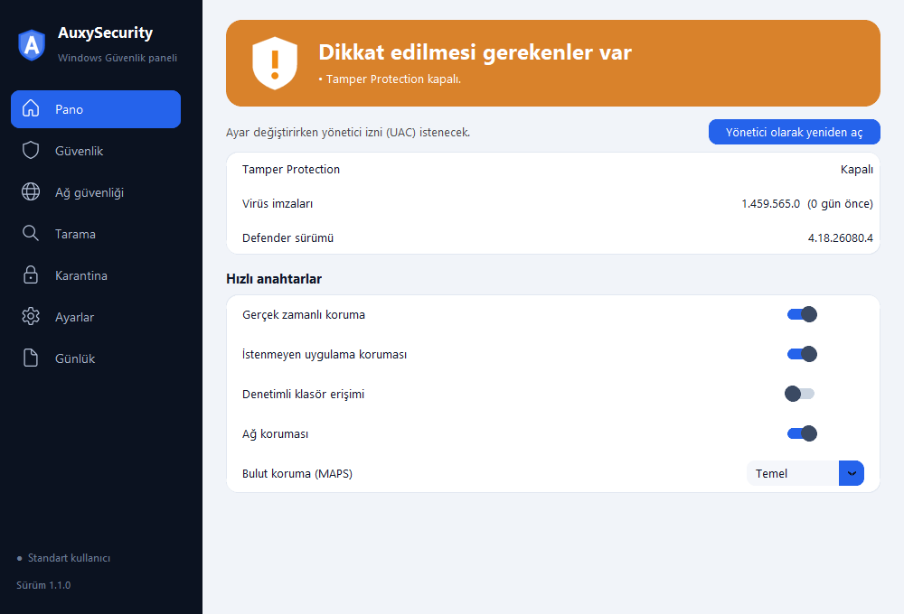
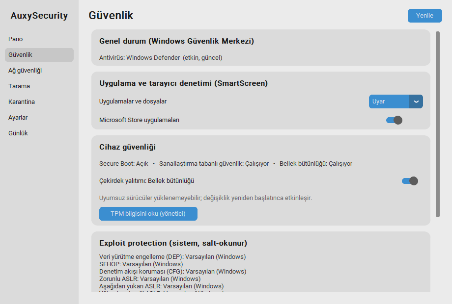
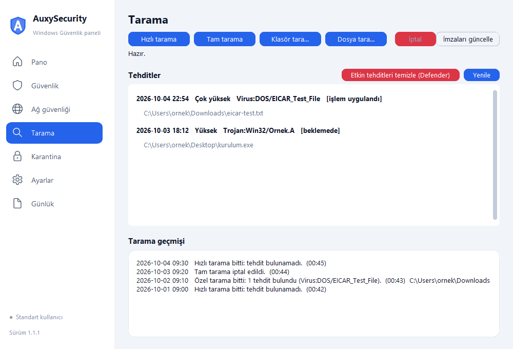
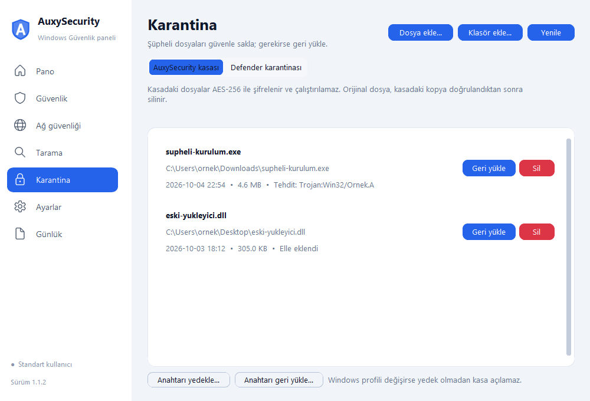
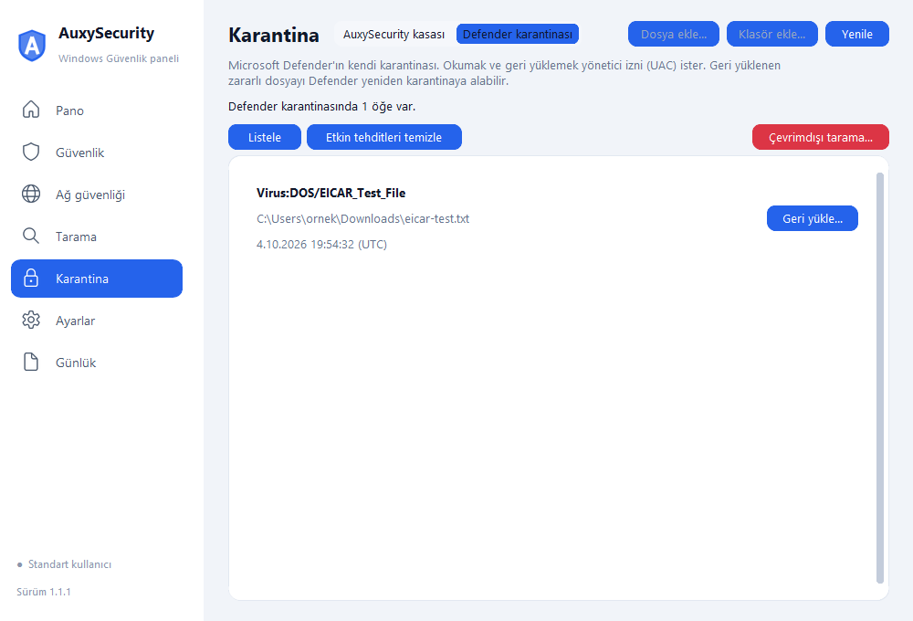
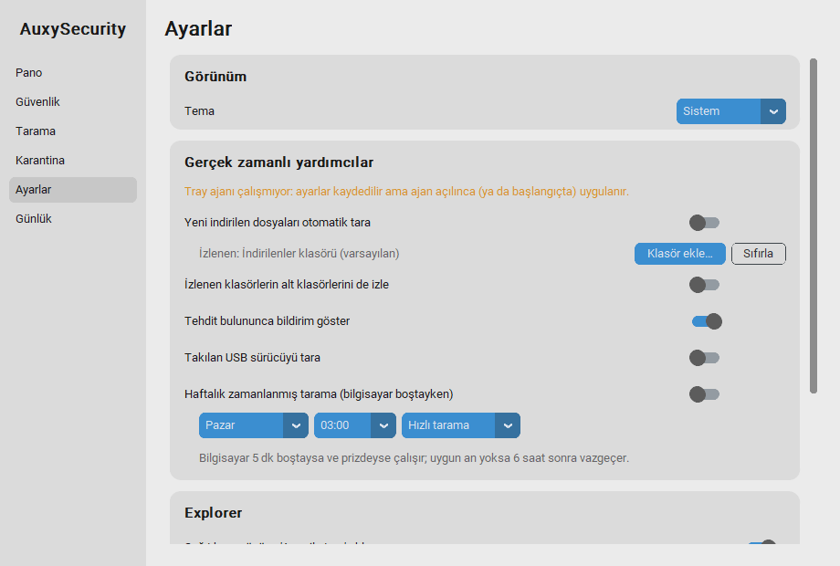
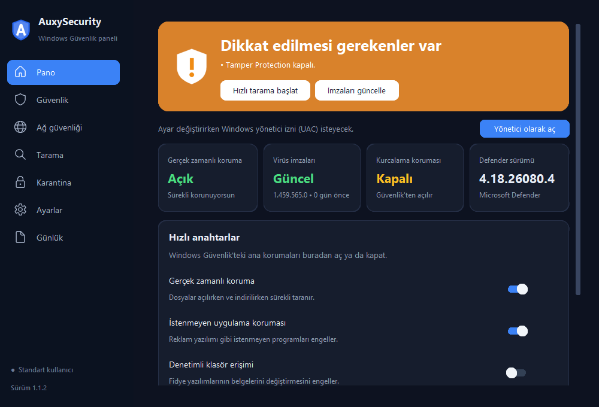

<div align="center">

# 🛡️ AuxySecurity

**Windows Güvenlik'i (Microsoft Defender) tek pencereden, hızlı anahtarlarla yönet.**
Hafif bir tray ajanı · şifreli karantina kasası · tarama yöneticisi · güvenlik duvarı ve SmartScreen kontrolü


-d9932b)



*A personal control panel for Windows Security / Microsoft Defender: quick toggles, scan manager,
encrypted quarantine vault, firewall & SmartScreen controls, and a tray agent that idles at ~0% CPU.*

</div>

---

## İçindekiler
[Nedir?](#nedir) · [Özellikler](#özellikler) · [Ekran görüntüleri](#ekran-görüntüleri) · [Kurulum](#kurulum) ·
[Kullanım](#kullanım) · [Nasıl çalışır?](#nasıl-çalışır) · [Güvenlik tasarımı](#güvenlik-tasarımı) ·
[Bilinen sınırlar](#bilinen-sınırlar) · [Performans](#performans) · [Geliştirme](#geliştirme) ·
[Proje yapısı](#proje-yapısı) · [Yol haritası](#yol-haritası)

---

## Nedir?

Microsoft Defender'ın tarama motoru çekirdek seviyesinde çalışır ve Python ile bundan iyisi yazılamaz.
**AuxySecurity kendi antivirüs motorunu yazmaz.** Bunun yerine Defender'ın üstüne oturan, günlük kullanıma
odaklı bir **kontrol paneli** sunar:

- Windows Güvenlik'te birkaç tıkla ulaşılan ayarlara **tek pencereden ve tray menüsünden** erişirsin.
- Şüpheli dosyaları **kendi şifreli kasana** alırsın; Defender'ın dokunmadığı dosyalar için de.
- İndirilen dosyalar, takılan USB'ler ve zamanlanmış taramalar için **hafif otomasyon** kurarsın.
- Yönetici izni gereken her işte **uygulama kendisi UAC ister**; seni başka bir pencereye göndermez.

> **Dürüst olmak gerekirse:** Windows bazı ayarları (gerçek zamanlı koruma ve bulut koruma gibi) dışarıdan
> değiştirmeye izin vermiyor. Bu durumda uygulama sessizce başarılı görünmez; değişikliği **geri okuyup
> doğrular** ve uygulanmadıysa nedenini söyler. Ayrıntı: [Bilinen sınırlar](#bilinen-sınırlar).

## Özellikler

| Alan | Neler yapabilirsin |
|---|---|
| **Pano** | Güvenlik durumunu tek bakışta gör (yeşil / sarı / kırmızı), gerçek zamanlı koruma, bulut koruma, istenmeyen uygulama koruması, denetimli klasör erişimi ve ağ korumasını hızlı anahtarlarla yönet |
| **Tray ajanı** | Saatin yanında durum simgesi; hızlı tarama, anahtarlar, güvenlik duvarı alt menüsü, son tehdidi kasaya alma. Boşta **CPU ≈ %0**, olay tabanlı |
| **Tarama** | Hızlı / tam / klasör / dosya taraması, iptal, imza güncelleme, tehdit listesi, tarama geçmişi, **sürükle-bırak** ve **Explorer sağ tık** ("Auxy ile tara") |
| **Karantina kasası** | AES-256-GCM ile şifreli, çalıştırılamaz; kasaya alırken doğrulama, geri yükleme, kalıcı silme, çoklu dosya, **parola korumalı anahtar yedeği** |
| **Defender karantinası** | Defender'ın kendi karantinasını listele ve geri yükle, etkin tehditleri temizle, (onaylı) çevrimdışı tarama |
| **Güvenlik** | Güvenlik duvarı profilleri ve gelen bağlantı eylemi, kural listesi (pasifleştir / geri aç), program engelleme, SmartScreen, çekirdek yalıtımı (bellek bütünlüğü), Secure Boot / TPM / exploit protection durumu, Defender dışlamaları |
| **Otomasyon** | İndirilenler klasörünü izleme, Defender tehdit bildirimleri (olay günlüğü aboneliği), USB tarama, haftalık zamanlanmış tarama (boştayken), Windows açılışında başlatma |
| **Tanı ve bakım** | `auxy doctor` (ortam/kurulum tanısı, hiçbir şeyi değiştirmez), `auxy cleanup` (kaldırma temizliği), `auxy revert-all` |
| **CLI** | Her şeyin komut satırı karşılığı (`auxy status`, `auxy scan quick`, `auxy vault add …`) |

Hepsi **geri alınabilir** olacak şekilde tasarlandı: bir ayarı ilk değiştirdiğinde orijinal değeri yedeklenir
(`auxy revert`, `auxy winsec-revert`).

## Ekran görüntüleri

<table>
<tr>
<td><br><sub><b>Güvenlik</b>: güvenlik duvarı, SmartScreen, cihaz güvenliği</sub></td>
<td><br><sub><b>Tarama</b>: tehditler ve geçmiş</sub></td>
</tr>
<tr>
<td><br><sub><b>Karantina kasası</b>: şifreli, geri yüklenebilir</sub></td>
<td><br><sub><b>Defender karantinası</b>: listele ve geri yükle</sub></td>
</tr>
<tr>
<td><br><sub><b>Ayarlar</b>: otomasyon ve başlangıç</sub></td>
<td><br><sub><b>Koyu tema</b> desteklenir</sub></td>
</tr>
</table>

<sub>Görüntülerdeki tehdit, geçmiş ve kasa listeleri örnek verilerdir (`scripts/readme_shots.py`).</sub>

## Kurulum

### Hazır kurulum (önerilen, Python gerekmez)

`AuxySecurity-Setup.exe` dosyasını çalıştır (UAC sorar) ya da sessiz kur:

```powershell
AuxySecurity-Setup.exe /S /AUTOSTART /CONTEXTMENU   # ayrıca /DIR=... /DESKTOP /NOSTARTMENU
```

Kaldırma: *Ayarlar → Uygulamalar* ya da `AuxySecurity.exe uninstall` (ayarların ve karantina kasan korunur). Kurulum programını kendin üretmek için: `scripts\build.ps1` ardından `scripts\build_installer.ps1` ([M9](docs/milestones/M09-packaging.md)). Sürüm notları: [CHANGELOG](CHANGELOG.md).

### Kaynaktan (geliştirme)

**Gereksinimler:** Windows 11 (Windows 10'da denenmedi), Python **3.12+**, Microsoft Defender etkin (başka bir antivirüs birincil ise bazı özellikler çalışmaz).

```powershell
git clone https://github.com/auxydev/AuxySecurity.git
cd AuxySecurity

python -m venv .venv
.\.venv\Scripts\Activate.ps1
pip install -e ".[dev]"
```

Çalıştır:

```powershell
python -m auxy gui        # pencere
python -m auxy agent      # tray ajanı (saatin yanındaki ^ altında olabilir)
```

**Windows açılışında otomatik başlatmak için:** GUI → *Ayarlar → Başlangıç* anahtarı, ya da
`python -m auxy autostart install --elevate`. Görev Zamanlayıcı ile oturum açılışından 30 sn sonra,
yüksek yetkiyle (her açılışta UAC sorulmadan) başlar.

> **Not:** Python'un Microsoft Store sürümü `%LOCALAPPDATA%` yazımlarını sanallaştırır; uygulama verisi
> (kasa, yedekler, günlük) bu durumda Python paketinin özel alanında tutulur. Önemli dosyaların tek kopyasını
> kasaya koymadan önce [Bilinen sınırlar](#bilinen-sınırlar)'ı oku.

## Kullanım

### Pencere ve tray
`python -m auxy gui` ile açılan pencerede **Pano · Güvenlik · Tarama · Karantina · Ayarlar · Günlük** sayfaları var.
Bir ayarı değiştirmek yönetici izni gerektiriyorsa standart Windows UAC penceresi açılır; reddedersen hiçbir şey
değişmez ve anahtar gerçek duruma döner.

### Komut satırı

| Komut | Açıklama |
|---|---|
| `auxy status` | Defender durumu (salt-okunur, yönetici gerekmez) |
| `auxy get` · `auxy set pua off` · `auxy revert` | Defender ayarlarını göster / değiştir / orijinale döndür |
| `auxy scan quick` · `scan full` · `scan custom <yol>` | Tarama başlat |
| `auxy threats` · `auxy update-signatures` | Tehdit tespitleri, imza güncelleme |
| `auxy vault add <dosya…>` · `vault list` · `vault restore <id>` | Karantina kasası |
| `auxy vault export-key <dosya>` · `vault import-key <dosya>` | Parola korumalı anahtar yedeği |
| `auxy defender-quarantine list` · `restore <yol>` · `clean` | Defender'ın kendi karantinası (UAC) |
| `auxy winsec-get` · `winsec-set fw_private off` · `winsec-revert` | Güvenlik duvarı, SmartScreen, çekirdek yalıtımı |
| `auxy firewall-rule list` · `disable <ad>` · `block <program>` | Güvenlik duvarı kuralları |
| `auxy exclusion list path` · `add path C:\proje` | Defender dışlamaları |
| `auxy autostart install` · `context-menu install` | Başlangıç görevi, sağ tık menüsü |
| `auxy doctor` · `cleanup` · `revert-all` | Tanı, kaldırma temizliği, tüm ayarları geri alma |

Tüm komutlar için `python -m auxy --help`.

## Nasıl çalışır?

```
┌────────────────────────────────────────────────┐
│ auxy agent  (tray · olay tabanlı · boşta ≈ %0) │  ← başlangıçta çalışan TEK küçük süreç
│  ├─ klasör izleme  (ReadDirectoryChangesW)     │
│  ├─ Defender olay günlüğü aboneliği (push)     │
│  ├─ USB bildirimi (WMI) · haftalık zamanlayıcı │
│  └─ ayar değişikliği: adlı Windows olayı       │
└───────────────┬────────────────────────────────┘
                │ "Paneli aç" → ayrı süreç
┌───────────────▼────────────────┐
│ auxy gui  (customtkinter)      │   kapatınca bellekten düşer
└───────────────┬────────────────┘
                │ ikisi de aynı kütüphaneyi kullanır
┌───────────────▼─────────────────────────────────────────────┐
│ auxy.core  (arayüzden bağımsız, test edilebilir)            │
│  defender · scan · vault · winsec · firewall · exclusions … │
└───────────────┬─────────────────────────────────────────────┘
                │ yönetici gerekiyorsa
        gizli yükseltilmiş yardımcı süreç (UAC) → sonuç JSON ile geri döner
```

- **Okuma hızlı:** Defender durumu PowerShell yerine doğrudan **WMI**'dan (~100 ms), güvenlik duvarı ve SmartScreen kayıt defterinden okunur.
- **Yük oluşturmaz:** Sürekli döngü yok; `watchdog`, `EvtSubscribe` ve WMI bildirimleri olay gelene kadar uyur.
- **UAC akışı:** Yönetici gereken işlerde uygulama kendisi yükseltilmiş bir yardımcı başlatır, sonucu geçici bir dosyadan okur. Yardımcı yalnızca `%TEMP%` altındaki `auxy-result-*` dosyalarına yazabilir.

## Güvenlik tasarımı

- **Geri alınabilirlik zorunlu.** Her ayar değişikliği önce orijinal değeri yedekler; yazdıktan sonra değer **geri okunup doğrulanır**. Windows komutu sessizce yok sayarsa bu tespit edilir.
- **Komut enjeksiyonu yok.** Kullanıcı girdisi PowerShell komut metnine **gömülmez**; ortam değişkeniyle aktarılır ve komutlar sabittir. Ayar adları ve değerleri izinli listeden seçilir.
- **Tehlikeli işlemler sınırlı.** Dışlamalarda tüm sürücü, Windows dizini ve çalıştırılabilir uzantılar reddedilir; yalnızca kendi pasifleştirdiğin güvenlik duvarı kuralı geri açılabilir; engel kuralları yalnızca `AuxySecurity-` önekli.
- **Kasa şifreleme:** AES-256-GCM, parçalı (büyük dosyalar belleğe yüklenmez), her parça kimlik doğrulamalı; kesme, ekleme ve yeniden sıralama tespit edilir. Anahtar Windows **DPAPI** ile korunur. Orijinal dosya, kasadaki kopya doğrulandıktan **sonra** silinir.
- **Anahtar yedeği:** scrypt + AES-GCM ile parola korumalı; veri dizininin **dışına** yazılır.
- **Koruma listesi:** `C:\Windows`, Defender dizini, uygulamanın kendi dosyaları, klasörler ve sembolik bağlantılar kasaya alınamaz.
- **Onaylar:** Güvenliği azaltan (güvenlik duvarını kapatma, SmartScreen kapatma, "İzin ver", dışlama ekleme) ve geri dönüşü zor işlemler (çevrimdışı tarama = yeniden başlatma) açık onay ister.

## Bilinen sınırlar

Bunlar bilinçli ve belgelenmiş sınırlardır:

- **Gerçek zamanlı koruma ve bulut korumayı dışarıdan değiştirmek bu makinede mümkün olmadı.** Windows `Set-MpPreference` komutunu hata vermeden yok sayıyor. Uygulama kontrolü sunar, ama değişmezse "değiştirilemedi" der. Güvenlik ilkesi (kayıt defteri) yolu bilerek kullanılmadı.
- **Exploit protection salt-okunur:** Windows ayarı tek tek "varsayılana dön" sunmaz; yazmak geri alınamaz olurdu.
- **Defender karantinasından kalıcı silme** yok (MpCmdRun sunmuyor); alternatif klasöre geri yüklemede Defender öğeyi listede tutar.
- **Python Store sürümü:** Uygulama verisi Python paketinin özel alanında durur; paketi kaldırmak kasayı da siler. Anahtar yedeğini mutlaka al.
- **Anahtar Windows kullanıcısına bağlı (DPAPI):** Profil kaybolursa yedek olmadan kasa açılamaz.
- **UAC ile çalışan kod yazılabilir dizinlerden gelir:** Geliştirme kurulumunda `.venv` ve `src` kullanıcı tarafından yazılabilir; bu hesapta çalışan zararlı bir program yönetici yetkisi kazanabilir. `auxy doctor` ve Ayarlar bunu uyarır, yüksek yetkili başlangıç görevi kurarken onay ister. Kurulu (`Program Files`) sürüm bu riski kapatır (`auxy doctor` doğrular); imzalama için `scripts/sign.ps1` hazır, sertifika sende. Ayrıntı: [güvenlik gözden geçirmesi](docs/security-review.md).
- **Doğrulanmayanlar:** Gerçek USB, haftalık tetiklenme, oturum açılışı, bildirim balonu ve çevrimdışı tarama (yeniden başlatır) gerçek ortamda denenmedi. Ayrıntı: [B01](docs/milestones/B01-eksik-tamamlama.md).

## Performans

Gerçek makinede ölçüldü (Windows 11):

| Ölçüm | Sonuç |
|---|---|
| Tray ajanı, izleme + olay aboneliği açık | **CPU %0.000** (30 sn); RAM: çalışma kümesi **≈ 3 MB**, özel bellek ≈ 24 MB |
| Pencere açılışı | ~0.35–0.9 sn |
| Defender durumu okuma (WMI) | ~100 ms (PowerShell: ~600 ms) |
| 150 MB dosyayı kasaya alma (şifrele + doğrula + sil) | 0.7 sn |
| Ayar değişikliği → ajana ulaşma | 0.11 sn |

## Geliştirme

```powershell
pytest -q                           # 414 test, ~40 sn (GUI testleri dahil), kapsam %89
python -m auxy doctor               # ortam tanısı
python scripts\unused_imports.py src
```

- Testler gerçek `watchdog`, gerçek Windows olayları, gerçek DPAPI, gerçek PowerShell ve gerçek kayıt defteri (test alt anahtarı) kullanır; yalnızca yıkıcı veya yönetici gerektiren adımlar sahte yürütücüyle taklit edilir.
- `scripts/` altında **gerçek makine testleri** vardır (`m6_live.py`, `backfill_live_admin.py`, `dq_live.py` …). Yönetici gerektirenler UAC ister, yaptığı her değişikliği geri alır ve sonda "başlangıçla aynı" doğrulaması yapar. Güvenlik duvarını kapatan adım yalnızca `--firewall` ile çalışır.
- Ekran görüntüsü betikleri ekranı kopyalamaz (`PrintWindow`); başka pencereler görüntüye girmez.
- Çalışma yöntemi: **sürekli prototipleme**. Her milestone sonunda çalıştırılabilir bir prototip, test kanıtı ve doküman çıkar ([docs/](docs/README.md)).

## Proje yapısı

```
AuxySecurity/
├─ src/auxy/
│  ├─ core/      Defender, tarama, kasa, güvenlik duvarı, SmartScreen, dışlamalar, UAC akışı …
│  ├─ agent/     tray ajanı, klasör izleme, olay aboneliği, USB, zamanlayıcı
│  ├─ gui/       pencere, sayfalar (pano, güvenlik, tarama, karantina, ayarlar)
│  └─ __main__.py   CLI
├─ tests/        pytest (414 test)
├─ scripts/      gerçek makine testleri, ölçümler, ekran görüntüsü üretimi
├─ docs/         milestone dokümanları, mimari kararlar, ekran görüntüleri
├─ PLAN.md       kapsamlı proje planı
└─ BACKLOG.md    ertelenen fikirler
```

## Yol haritası

| Milestone | Konu | Durum |
|---|---|---|
| [M0](docs/milestones/M00-spike.md) | Keşif ve teknik doğrulama | ✔ |
| [M1](docs/milestones/M01-core-cli.md) | Çekirdek kütüphane + CLI | ✔ |
| [M2](docs/milestones/M02-gui-dashboard.md) | GUI pano | ✔ |
| [M3](docs/milestones/M03-tray-autostart.md) | Tray ajanı, başlangıç, UAC akışı | ✔ |
| [M4](docs/milestones/M04-scan-manager.md) | Tarama yöneticisi | ✔ |
| [M5](docs/milestones/M05-quarantine-vault.md) | Şifreli karantina kasası | ✔ |
| [M6](docs/milestones/M06-windows-security.md) | Güvenlik duvarı, SmartScreen, cihaz güvenliği | ✔ |
| [M7](docs/milestones/M07-realtime-helpers.md) | Gerçek zamanlı yardımcılar | ✔ |
| [B01](docs/milestones/B01-eksik-tamamlama.md) | Eski milestone eksiklerinin tamamlanması | ✔ |
| [M8](docs/milestones/M08-hardening.md) | Sağlamlaştırma: RAM, çökme kurtarma, güvenlik gözden geçirmesi, `doctor`, kapsam %86 | ✔ |
| [M9](docs/milestones/M09-packaging.md) | Paketleme: Program Files kurulumu, kurulum programı, kaldırıcı, eski veri taşıma, v1.0.0 | ✔ |

Fikirler ve ertelenenler: [BACKLOG.md](BACKLOG.md).

## Uyarı ve lisans

AuxySecurity bilgisayarının güvenlik ayarlarını değiştirebilir; **kendi sorumluluğunda kullan**. Bu bir antivirüs
motoru değildir, Microsoft Defender'ın yerine geçmez, onu yönetmene yardım eder.

**Lisans:** henüz belirlenmedi (bir `LICENSE` dosyası eklenene kadar tüm hakları saklıdır).
