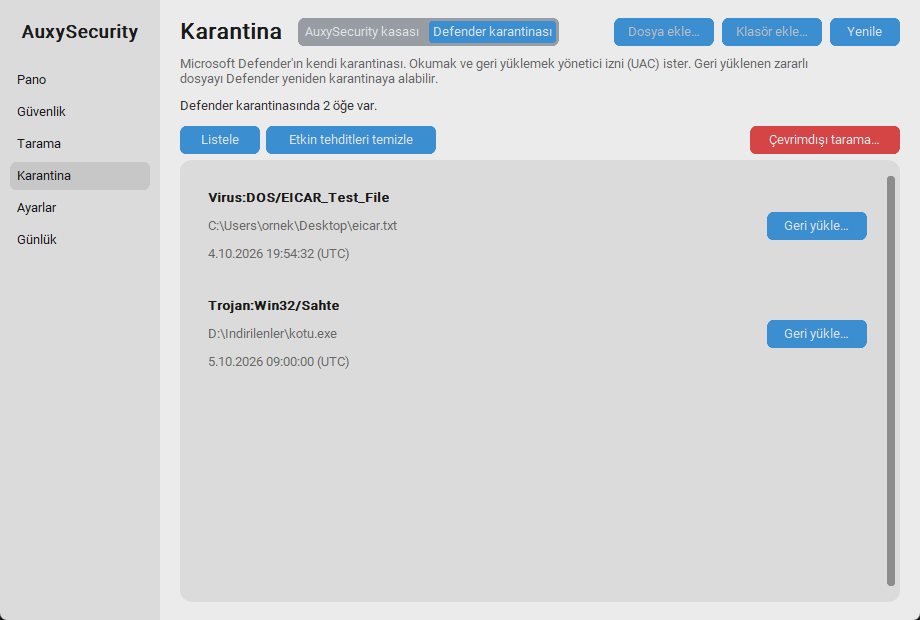
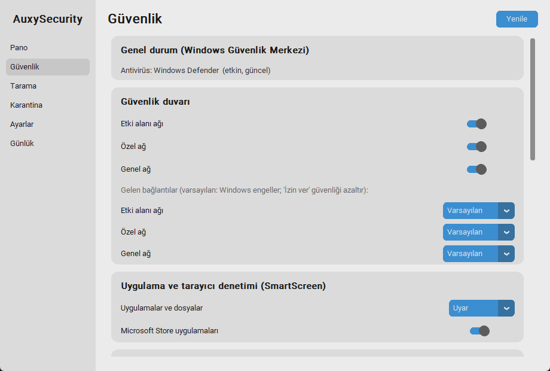

# B01 – Eski Milestone Eksiklerinin Tamamlanması

**Durum:** İncelemede  **Tarih:** 2026-10-05  **Kapsam:** M0–M7'de "yapılmadı / ertelendi / denenmedi" diye işaretlenen her kalem

## 1. Yöntem
Önce tüm milestone dokümanlarındaki (kapsam dışı, bölüm 8, ✘/⏳/◐ işaretleri) açık kalemleri taradım, her birini üç gruba ayırdım: **yapılabilir ve güvenli → yaptım**, **yapılamaz (Windows engeli / geri alınamazlık / fiziksel test) → nedenini yazdım**, **ayrıca düzeltilmesi gereken hata → düzelttim**. Her grup ayrı commit; her yazma yolu önce testle, sonra gerçek makinede denendi.

## 2. Tamamlananlar
| # | Kalem (kaynak) | Ne yapıldı | Gerçek makinede kanıt |
|---|---|---|---|
| 1 | **Windows açılışında başlat anahtarı** (M3: Ayarlar'da hiç eklenmemişti) | Ayarlar → "Başlangıç" anahtarı; UAC ile görev kur/kaldır; durum geri okunur (UAC reddedilirse anahtar eski haline döner) | ✔ GUI yoluyla görev kuruldu, XML doğrulandı, kaldırıldı |
| 2 | **Süreçler arası tarama kilidi** (M4) | Adlı Windows mutex'i: GUI, ajan ve CLI aynı anda tarama başlatamaz; ölen sürecin kilidi devralınır | ✔ Ayrı süreç kilidi tutarken tarama reddedildi, serbest kalınca çalıştı |
| 3 | **Sürükle-bırak taraması** (M4/M7) | `tkinterdnd2`: dosya/klasörleri pencereye bırakınca taranır; çoklu bırakma sırayla, iptalde durur | ◐ tkdnd yüklendi, bırakma işleyicisi testli; **gerçek fare sürüklemesi denenmedi** |
| 4 | **Alt klasör izleme** (M7) | Ayarlar'da "alt klasörleri de izle"; ajan anında uygular | ✔ gerçek `watchdog` testi (açık/kapalı) |
| 5 | İlerleme çubuğu kozmetiği (M4) | Boşta gizli, taramada görünür | ✔ GUI testi |
| 6 | **Çoklu dosya / klasör kasaya alma** (M5) | Çoklu seçim, klasör (üst düzey dosyalar, onaylı), kısmi hata özeti, CLI `vault add a b c` | ✔ test + GUI akışı |
| 7 | **Kasa anahtarı yedeği** (M5, riski: profil kaybı = veri kaybı) | Parola korumalı (scrypt + AES-GCM) dışa/içe aktarma; yedek veri dizininin **dışına** yazılır; içe aktarırken anahtarın kasadaki dosyaları gerçekten açtığı doğrulanır, açmıyorsa mevcut anahtara dokunulmaz | ✔ gerçek DPAPI ile "anahtar dosyası silindi → yedekten kurtarıldı → dosya geri yüklendi" |
| 8 | **Defender karantinası** listele / geri yükle (M5) | Karantina sayfasında ikinci görünüm; UAC ile liste; geri yükle (orijinal ya da başka klasör) | ✔ gerçek: 4 öğe listelendi, EICAR alternatif klasöre geri yüklendi, **Türkçe yol** (`Çalışma Klasörü\kötü-eicar.txt`) bozulmadan |
| 9 | **Tehdit aksiyonu: etkin tehditleri temizle** (M4) | `Remove-MpThreat`; tehdit listesinde yalnızca etkin tehdit varken düğme çıkar | ✔ gerçek (UAC) |
| 10 | **Çevrimdışı tarama** (M4) | `Start-MpWDOScan` + iki aşamalı onay (yeniden başlatır); CLI `--yes` ister | ⏳ **Bilerek çalıştırılmadı** (bilgisayarı yeniden başlatır); testlerde hep sahte yürütücü, "gerçek komut asla çalışmaz" testi var |
| 11 | **Güvenlik duvarı kuralları** (M6: "yapılmadı") | Etkin gelen kuralları listele (yönetici gerekmez), ara/filtrele, **pasifleştir / yeniden etkinleştir** (silme yok; yalnızca kendi pasifleştirdiğimizi geri açarız), **program engelle / engeli kaldır** (yalnız `AuxySecurity-` önekli, gelen+giden) | ✔ gerçek (UAC): pasifleştir→etkinleştir, engelle→kaldır, tekrar engelle (idempotent), boşluklu Türkçe yolla UAC yardımcı yolu |
| 12 | **Gelen bağlantı eylemi** (M6) | Profil başına Varsayılan / Engelle / İzin ver (İzin ver onay ister); 3 profil tek sorguyla okunur | ✔ gerçek: Varsayılan→Engelle→Varsayılan, `Get-NetFirewallProfile` ile doğrulandı |
| 13 | **Tray'e güvenlik duvarı anahtarları** (M6) | Alt menü; kapatmak Windows onay kutusu ister | ◐ menü yapısı ve onay mantığı testli; gerçek tray tıklaması görülmedi |
| 14 | **Koyu tema görsel kontrolü** (M2, M6) | Tüm sayfalar koyu temada ekran görüntüsüyle kontrol edildi | ✔ düzeltme gerektiren sorun çıkmadı |

## 3. Bu sırada bulunan ve düzeltilen gerçek hatalar
1. **`auxy revert` (hepsi) çöküyordu.** Yedek dosyası artık `ws:…`/`fwrules` anahtarlarını da içerdiğinden `UnknownSettingError` fırlatıyordu. Hata önce yeniden üretildi, sonra düzeltildi; yalnızca Defender ayarlarını geri alıyor, diğer yedeklere dokunmuyor (regresyon testi).
2. **PowerShell çıktısında Türkçe karakterler bozuluyordu** (`Kullanımı` → `Kullan?m?`). Windows PowerShell 5.1 çıktıyı OEM kod sayfasında yazıyor, biz UTF-8 çözüyorduk. Etkilenenler: kural adları, dışlama yolları, hata mesajları. Ortak `core/pshell.py` çalıştırıcısı (UTF-8 zorlar; değerler yalnızca ortam değişkeniyle) tüm çağrı noktalarına uygulandı. MpCmdRun gibi yerel programların çıktısı için UTF-8→OEM kod sayfası geri düşüşü eklendi. Gerçek PowerShell'le çalışan testler eklendi.
3. **Güvenlik duvarı kural listesi ilk kullanımda çökerdi:** PowerShell betik şablonu `str.format` ile dolduruluyordu, betiğin kendi `{ }` blokları yüzünden `IndexError`. Birim testi yakaladı; `replace` ile düzeltildi.
4. **Defender geri yükleme doğrulaması yanlıştı.** Gerçek testte dosya hedefe yazıldığı halde "uygulanmadı" deniyordu: alternatif klasöre geri yüklemede Defender öğeyi karantina listesinde **tutuyor**. Doğrulama gerçek davranışa göre düzeltildi (hedefte dosya var mı); test sahtesi de gerçek davranışa uyduruldu.
5. **Başlangıç görevi çalışma dizini `System32` olurdu:** XML `os.getcwd()` kullanıyordu; yükseltilmiş yardımcıdan çağrılınca yanlış dizin yazılırdı. Proje dizininden türetilir oldu.
6. **Kırılgan testler sağlamlaştırıldı:** art arda `Tk()` açma Tcl hatası verebiliyor (tek ortak pencere: `tests/conftest.py`), terk edilmiş mutex yarışı (en geç 2 sn'de devralınır).
7. Ayrıca: GUI `Kasa → Defender → Kasa` geçişinde eski durum mesajı kalıyordu (düzeltildi), kullanılmayan import'lar temizlendi (`scripts/unused_imports.py`).

## 4. Yapılmayanlar ve nedenleri
| Kalem | Neden |
|---|---|
| `realtime` ve `maps` uygulamadan değiştirme | **Windows engelliyor** (M1/M3 testleri: komut hatasız döner, değer değişmez). Kayıt defteri ilkesi yolu güvenlik sistemi tarafından engellendi ve atlatılmadı |
| "Koruma duraklat" | Gerçek zamanlı korumayı kapatmaya bağlı; yukarıdaki engel |
| Exploit protection yazma | Windows tek tek "varsayılana dön" sunmaz; açıp kapatmak **geri alınamaz** olurdu |
| Edge SmartScreen | Edge'in kendi ayarı/ilkesi; güvenilir yazılabilir yol yok |
| Hesap koruması / Aile / Cihaz performansı | API yok; Windows Security'ye yönlendirme **istemediğin** için eklenmedi |
| Güvenli silme | SSD'lerde anlamsız; zararlı için gereksiz |
| Defender karantinasından **kalıcı silme** | MpCmdRun böyle bir komut sunmuyor |
| Kasa sayfalaması | Gereksiz (kasa yüzlerce kayda ulaşmaz) |

## 5. Hâlâ doğrulanmayanlar (kodlandı, gerçek ortamda denenmedi)
- **Güvenlik duvarı profilini kapatıp açma** (`Set-NetFirewallProfile -Enabled`): `--firewall` bayrağı olmadan çalışmaz. İstersen yönetici PowerShell'de: `.\.venv\Scripts\python scripts\backfill_live_admin.py $env:TEMP\bf.txt $env:TEMP\bfwork --firewall`
- **Bellek bütünlüğünü gerçekten değiştirme** (yeniden başlatma ister, riskli)
- **Çevrimdışı tarama** (yeniden başlatır)
- **Gerçek USB takma, haftalık tetiklenme, oturum açılışında otomatik başlama (30 sn gecikme), Windows bildirim balonu, tray menüsünün gözle incelenmesi**
- **Gerçek fare ile sürükle-bırak** (işleyici testli; tkdnd olayı el ile üretilemiyor)

## 6. Ölçüm
- Testler: **185 → 276** (+91). Süre ~16 sn (GUI testleri dahil).
- Yeni modüller: `core/pshell.py`, `core/firewall.py`, `core/defender_quarantine.py`; `core/vault.py` (anahtar yedeği), `core/system.py` (`ScanLock`), `gui/vault_page.py` (Defender görünümü, parola kutusu), `gui/security_page.py` (kural kartı), `gui/settings_page.py` (başlangıç).
- Yeni test dosyaları: `test_backfill1…5.py`, `conftest.py`. Gerçek makine betikleri: `backfill_live_admin.py`, `dq_live.py`, `hold_scan_lock.py`, `shot_quarantine_modes.py`.
- Yönetici testi çıktısı: `SONUC: BASLANGICLA AYNI` (221 kural, 0 engel, ayarlar aynı).

## 7. Ekran görüntüleri

## 8. İnceleme notları
_(Senin geri bildirimin buraya eklenecek.)_
