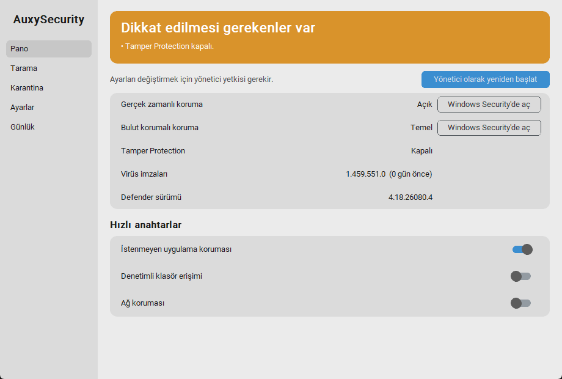

# M2 – GUI İskeleti: Pano

**Durum:** İncelemede  **Tarih:** 2026-10-04

## 1. Hedef
İlk görülebilir arayüz: tek bakışta güvenlik durumu ve gerçek ayarlara bağlı hızlı anahtarlar.

## 2. Kapsam / Kapsam dışı
- Kapsam: ana pencere, sol menü, Pano (sağlık özeti, durum satırları, anahtarlar), Ayarlar (tema), Günlük (canlı log), yönetici olarak yeniden başlatma.
- Kapsam dışı: Tarama (M4), Karantina (M5), tray ve başlangıç (M3). Bu sayfalar yer tutucu.

## 3. Prototip: nasıl çalıştırılır
```powershell
.\.venv\Scripts\python -m auxy gui
```
Anahtarların çalışması için pencere yönetici olmalı: pencerede **"Yönetici olarak yeniden başlat"** düğmesi var (UAC sorar), ya da yönetici terminalinden aç.



Ekran görüntüsü yönetici olmayan oturumdan: anahtarlar devre dışı, sarı başlık "Tamper Protection kapalı" uyarısını gösteriyor.

## 4. Yapılanlar
- [x] `gui/viewmodel.py`: genel sağlık değerlendirmesi (yeşil/sarı/kırmızı + nedenler), imza yaşı. UI'dan bağımsız, test edilebilir
- [x] `gui/worker.py`: iş parçacığı + kuyruk; **yoklama (poll) yalnızca iş varken** çalışır
- [x] `gui/app.py`: customtkinter pencere, sol menü (Pano · Tarama · Karantina · Ayarlar · Günlük)
- [x] Pano: sağlık başlığı, durum satırları, `pua` / `cfa` / `netprot` anahtarları (gerçek `DefenderService.set`)
- [x] `realtime` ve `maps`: salt-okunur + "Windows Security'de aç" düğmesi (M1 bulgusu)
- [x] Yönetici değilse anahtarlar devre dışı + yeniden başlatma düğmesi
- [x] Otomatik yenileme 30 sn, pencere küçültülmüşken sorgu yok
- [x] Ayarlar sayfası: tema (Sistem/Açık/Koyu); Günlük sayfası: son 200 satır
- [x] `auxy gui` komutu (GUI kütüphanesi geç import edilir, CLI komutları yüklemez)
- [x] Ayar etiketleri Türkçe karakterli; bayat yedek kaydı hatası düzeltildi (aşağıda)
- [x] 33 birim testi, `scripts/shot_gui.py` (ekran görüntüsü + ölçüm), `scripts/gui_e2e.py` (yönetici uçtan uca testi)

## 5. Teknik kararlar
- **customtkinter:** PySide6'dan hafif, kurulumu kolay.
- **Anahtar sonrası geri okuma:** İşlem sonunda her zaman `read_status` çağrılır; Defender değeri uygulamadıysa anahtar gerçek duruma döner (M1'deki sessiz engel senaryosunda yanlış "açık" göstermez).
- **Gerçek zamanlı korumada karar:** M1 testinde Windows `realtime` ve `maps` yazmalarını sessizce yok sayıyor. Anahtar koymak yerine durum + Windows Security kısayolu gösteriliyor; **ilke (policy) kayıt defteri yolu denenmeyecek.**

## 6. Kabul kriterleri ve sonuçlar
| Kriter | Sonuç |
|---|---|
| Pencere < 1.5 sn'de açılır | ✔ ~350–400 ms (pencere hazır) |
| Toggle → gerçek durum değişir | ✔ **Yönetici uçtan uca test:** `pua` anahtarı kapatıldı → Defender'da 1→0, geri açıldı → 0→1, orijinal değer döndü |
| Arayüz donmaz (iş parçacığı + kuyruk) | ✔ `set` (PowerShell ~1 sn) ayrı iş parçacığında; worker testleri geçti |
| Yönetici değilken anahtarlar güvenli | ✔ devre dışı, yeniden başlatma düğmesi görünür |
| Sağlık göstergesi doğru | ✔ 7 birim testi (açık/kritik/uyarı/imza yaşı/Tamper) |
| Testler | ✔ 33 passed |

## 7. Performans ölçümü
| Ölçüm | Sonuç | Hedef |
|---|---|---|
| Pencere hazır | ~350–400 ms | < 1.5 sn ✔ |
| Süreç RSS (GUI açık, ilk veri sonrası) | ~69 MB | Bu sadece **pencere**; hedef olan 40 MB, boşta çalışan tray ajanı içindir (M3'te ayrı süreç) |
| Boşta CPU | Ölçülmedi; tek sürekli iş 30 sn'lik yenileme (~100 ms WMI) | – |

## 8. Bilinen sorunlar / Riskler
- **Düzeltilen hata:** Bir ayar elle orijinal değerine döndürülünce yedek kaydı bayat kalıyor ve `get` "değiştirildi" gösteriyordu. Servis artık eşleşince kaydı siliyor (`test_manual_return_to_original_clears_stale_backup`).
- **Microsoft Store Python, `%LOCALAPPDATA%` yazımlarını sanallaştırıyor:** Yedek ve günlük dosyaları gerçekte `...\Packages\PythonSoftwareFoundation...\LocalCache\Local\AuxySecurity` altına gidiyor; PowerShell/Explorer `AppData\Local\AuxySecurity`'yi boş görüyor. Python içinden tutarlı çalışıyor. **M9'da** (PyInstaller sürümü sanallaştırılmaz) veri yolu değişeceği için yedek taşıma/uyumluluk gerekecek. Alternatif: python.org sürümü ya da `AUXY_HOME` ile sabit dizin.
- `realtime` ve `maps` hâlâ doğrudan değiştirilemiyor (bkz. M1). Hızlı aç/kapat vaadinin bir parçası eksik.
- GUI yöneticiyle yeniden başlatılınca yeni süreç açılıyor; eski pencere kapanıyor (UAC reddedilirse eski kalıyor).
- Açık/koyu tema yalnızca açık temada ekran görüntüsüyle denendi; koyu tema görsel olarak kontrol edilmedi.
- Pencere yönetici açıkken ağ koruması ve denetimli klasör erişimi ilk kez açıldığında Windows bildirimi çıkabilir; uygulama bunu işlemiyor.

## 9. İnceleme notları
_(Senin geri bildirimin buraya eklenecek.)_

## 10. Sonraki milestone'a etkisi
M3: tray ajanı boşta çalışacak ve GUI'yi ayrı süreç olarak açacak; yönetici sorunu Görev Zamanlayıcı ("en yüksek yetkiyle") ile çözülecek, böylece `Yönetici olarak yeniden başlat` düğmesi çoğunlukla gerekmeyecek.
