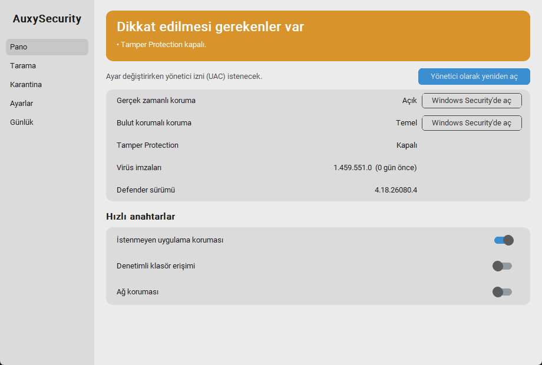

# M3 – Tray Ajanı, Hızlı Anahtarlar, Başlangıçta Çalışma ve UAC Akışı

**Durum:** İncelemede  **Tarih:** 2026-10-04

## 1. Hedef
"Başlangıçta çalışsın ve yük oluşturmasın." Boşta duran küçük bir tray ajanı, hızlı anahtarlar ve yönetici yetkisi gereken
işlerde **uygulamanın kendisinin UAC istemesi** (kullanıcıyı Windows Security'ye göndermeden).

## 2. Kapsam / Kapsam dışı
- Kapsam: tray ajanı (durum simgesi, menü, anahtarlar), UAC'li ayar değiştirme (GUI + tray ortak), Görev Zamanlayıcı ile oturum açılışında yüksek yetkili başlatma, tek örnek kilidi.
- Kapsam dışı: "Hızlı tara" menü öğesi (tarama M4'te), koruma duraklatma (aşağıda, **plandan çıkarıldı**).

## 3. Prototip: nasıl çalıştırılır
```powershell
.\.venv\Scripts\python -m auxy agent                  # tray simgesi (saatin yanındaki ^ altında olabilir)
.\.venv\Scripts\python -m auxy gui                    # pencere (ajan "Paneli aç" ile de açar)
.\.venv\Scripts\python -m auxy autostart install --elevate   # oturum açılışında başlat (UAC sorar)
.\.venv\Scripts\python -m auxy autostart status
.\.venv\Scripts\python -m auxy autostart remove --elevate    # geri al
```
Tray menüsü: durum başlığı · **Paneli aç** (sol tık da açar) · hızlı anahtarlar (İstenmeyen uygulama koruması, Denetimli klasör erişimi, Ağ koruması) · Gerçek zamanlı/Bulut durumu (salt-okunur) · Windows Security'yi aç · Yenile · Çıkış.

Simge renkleri (yeşil: korunuyor, sarı: dikkat, kırmızı: korunmuyor, gri: okunamadı):




## 4. Yapılanlar
- [x] **UAC akışı:** Yönetici olmayan süreç ayar değiştirirken gizli (pythonw) yüksek yetkili yardımcı süreç başlatır (`ShellExecuteEx` + `runas`), bitmesini bekler, sonucu geçici dosyadan okur. Kullanıcı yalnızca standart Windows UAC penceresini görür. UAC reddedilirse "Yönetici izni verilmedi." mesajı
- [x] `core/actions.py`: GUI ve tray'in ortak `apply_setting` katmanı (yönetici ise doğrudan, değilse UAC ile)
- [x] GUI: anahtarlar artık yönetici olmayan oturumda da etkin; pano uyarısı "Ayar değiştirirken yönetici izni (UAC) istenecek."; isteğe bağlı "Yönetici olarak yeniden aç"
- [x] `agent/tray.py`, `agent/icon.py`: pystray ajanı, dinamik menü, sağlık renkli simge, bildirimler (anahtar sonucu)
- [x] `core/autostart.py`: Görev Zamanlayıcı görevi (XML): oturum açılışı + 30 sn gecikme, `HighestAvailable`, pil kısıtı yok, zaman sınırı yok, tek örnek
- [x] CLI: `auxy agent`, `auxy autostart install|remove|status`, `set --result` (yardımcı süreç için)
- [x] Tek örnek kilidi (ajan ve GUI); GUI zaten açıksa mevcut pencereyi öne getirir
- [x] 46 test (UAC akışı, sonuç dosyası güvenliği, görev XML'i, simge, tray menüsü)

## 5. Teknik kararlar
- **UAC'yi uygulama istiyor, Windows Security'ye yönlendirme yok** (isteğin). `Yönetici izni verilmedi.` dışında kullanıcıya "elle yap" denmiyor.
- **Sonuç dosyası güvenliği:** Yükseltilmiş yardımcı yalnızca `%TEMP%` içinde, `auxy-result-` önekli bir dosyaya yazabilir (yol dışarıdan verilen bir yönetici-yazma yolu olmasın diye). Test: `test_result_path_only_in_temp_with_prefix` (`..` ile kaçış, System32 yolları reddedilir).
- **Zamanlayıcı:** Tek sürekli iş `threading.Event.wait(60)`; 60 sn'de bir ~100 ms WMI okuması, arası uyku. Menü açılışında ek sorgu yok (önbellekten).
- **Görev, yalnızca bu kullanıcının oturum açılışında** çalışır; sistem açılışında değil.
- **Başlatma:** `.venv\Scripts\pythonw.exe -m auxy agent` (konsolsuz).

## 6. Kabul kriterleri ve sonuçlar
| Kriter | Sonuç |
|---|---|
| Yönetici olmayan süreç ayarı değiştirirken UAC ister ve uygular | ✔ **Gerçek makinede:** `pua` on→off (Defender'da 0 okundu) →on, 2 UAC onayı, değerler geri döndü |
| UAC reddedilirse temiz hata | ✔ birim testi (`run_elevated_and_wait → None`); gerçek reddetme denenmedi |
| Başlangıç görevi kurulur / kaldırılır | ✔ **Gerçek makinede** UAC ile kuruldu, XML doğrulandı (`HighestAvailable`, `PT30S`), `remove` ile temizlendi (`installed=False`) |
| Görevle başlayan ajan yüksek yetkili, UAC'siz | ✔ Ajan günlüğü: `Ajan basladi (pid=27908, yonetici=True)`; `schtasks /Run` ile denendi |
| Boşta RAM < 40 MB, CPU < %0.5 | ◐ **CPU ✔ 0.000%** (30 sn). **RAM:** asıl süreç çalışma kümesi **40.8 MB** (özel bellek **21.9 MB**), + venv başlatıcı kalıntısı 11 MB. Task Manager'daki "bellek" (özel) 22 MB civarı ✔; çalışma kümesi hedefin hemen üstünde (bkz. sorunlar) |
| Oturum açılışında gerçekten tetiklenir | ⏳ `schtasks /Run` ile aynı eylem çalıştırıldı; **gerçek oturum açılışı + 30 sn gecikme senin oturum açışında doğrulanacak** (ben oturumu kapatamam) |
| Testler | ✔ 46 passed |

## 7. Performans ölçümü
| Ölçüm | Sonuç |
|---|---|
| Ajan CPU (30 sn, boşta) | 0.000 s artış |
| Ajan çalışma kümesi / özel bellek | 40.8 MB / 21.9 MB |
| venv başlatıcı (`pythonw.exe` stub) | 11.2 MB çalışma kümesi / 1.8 MB özel (kurulu sürümde olmayacak) |
| GUI pencere hazır | ~340 ms; RSS ~68 MB (yalnızca pencere açıkken) |
| Ayar değiştirme (UAC dahil) | UAC onayına bağlı; onaydan sonra ~1–2 sn |

## 8. Bilinen sorunlar / Riskler / Plandan sapmalar
- **"Koruma 10/30/60 dk duraklat" plandan çıkarıldı.** Gerçek zamanlı korumayı kapatma M1'de Windows tarafından engellendiği için duraklatma yapılamaz (ve ilke yolu denenmeyecek). Doğrulanmış çözüm bulunursa geri eklenir.
- **`realtime` ve `maps` hâlâ salt-okunur.** UAC vermek bunu çözmüyor, çünkü engel yetki değil Windows'un kendi korumasında (M1 testi yönetici yetkisiyle yapılmıştı).
- **RAM hedefi sınırda:** Çalışma kümesi ~41 MB. `win32com` ve PIL yükü büyük kısım. M8'de azaltma: gereksiz import'lar, simgeyi önceden çizip önbelleğe alma, gerekirse WMI'ı hafif COM çağrısıyla değiştirmek.
- **Güvenlik notu (M8/M9):** UAC ile yükseltilen süreç, kullanıcı tarafından yazılabilir `.venv` ve `src` dizinlerinden Python kodu çalıştırıyor. Yani bu klasöre yazabilen bir program UAC onayını kötüye kullanabilir. Kurulu sürüm `Program Files` altında ve imzalı olmalı; bu risk geliştirme kurulumuna özgü.
- **Microsoft Store Python:** `%LOCALAPPDATA%` sanallaştırması (M2 notu) devam ediyor; yardımcı ve ana süreç aynı sanal alanı gördüğü için akış çalıştı.
- Görev, `os.getcwd()`'yi çalışma dizini olarak yazıyor; `autostart install` proje klasöründen çalıştırılmalı. Proje taşınırsa görev yeniden kurulmalı (`remove` + `install`).
- Tray simgesi Windows 11'de varsayılan olarak taşma menüsünde (^) görünebilir; sabitlemek kullanıcı ayarı.
- Tray menüsü ve bildirimler gerçek tray'de **görsel olarak** incelenmedi (otomasyonla erişemiyorum); menü yapısı birim testiyle doğrulandı. Senin bakışın gerekiyor.
- Sistemde **görev bırakılmadı:** Test sonrası `autostart remove` çalıştırıldı. Kalıcı kurmak için yukarıdaki `install` komutu.

## 9. İnceleme notları
_(Senin geri bildirimin buraya eklenecek.)_

## 10. Sonraki milestone'a etkisi
M4 (Tarama): tray menüsüne "Hızlı tara" eklenecek; tarama ilerlemesi GUI'de. Tarama başlatmak (`Start-MpScan`) yönetici gerektirmeyebilir; denenecek. `actions` katmanı yeni eylemler için genişletilebilir yapıda.
