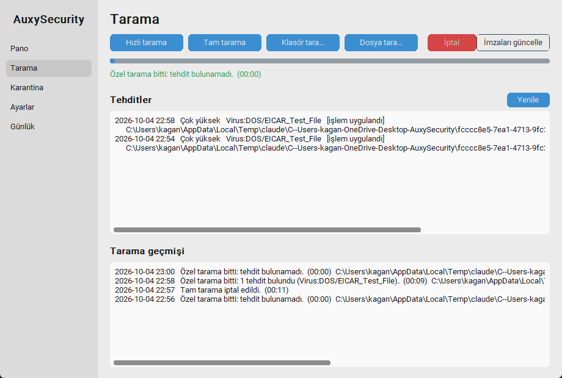

# M4 – Tarama Yöneticisi

**Durum:** İncelemede  **Tarih:** 2026-10-04

## 1. Hedef
Hızlı / tam / özel tarama başlatma, iptal, imza güncelleme, tehdit listesi ve tarama geçmişi; EICAR test dosyasının algılandığının kanıtı.

## 2. Kapsam / Kapsam dışı
- Kapsam: GUI Tarama sayfası, tray "Hızlı tara", CLI (`scan`, `threats`, `update-signatures`), tarama geçmişi, Defender tehdit tespitlerinin okunması.
- Kapsam dışı (plandan ertelenenler, bölüm 8): çevrimdışı tarama, sürükle-bırak / sağ tık taraması, tehdit aksiyonları (Defender'ın "temizle/kaldır"ı), Defender karantinasından geri yükleme.

## 3. Prototip: nasıl çalıştırılır
```powershell
.\.venv\Scripts\python -m auxy gui                          # sol menü > Tarama
.\.venv\Scripts\python -m auxy scan quick                   # bitene kadar bekler
.\.venv\Scripts\python -m auxy scan custom C:\klasor
.\.venv\Scripts\python -m auxy threats                      # tespit listesi
.\.venv\Scripts\python -m auxy update-signatures
```
Tray menüsünde **Hızlı tara** (tarama sürerken devre dışı, bitince bildirim).



Ekran görüntüsü: EICAR'ın daha önce bulunduğu (iki tespit kaydı) ve ardından GUI'den başlatılan özel taramanın geçmişi.

## 4. Yapılanlar
- [x] `core/scan.py`: `ScanManager` (MpCmdRun.exe: `-Scan -ScanType 1|2|3 [-File yol]`), tek anda tek tarama, sonuç sınıflandırma (tamamlandı / iptal / başarısız), yeni tehdit tespiti, geçmiş (`scan_history.json`, son 50)
- [x] `core/threats.py`: `MSFT_MpThreat` + `MSFT_MpThreatDetection` (WMI) birleştirme: ad, şiddet, dosya yolu, saat, işlem durumu
- [x] İptal: `MpCmdRun -Scan -Cancel` (yönetici gerekir → **UAC akışı**, M3'teki `actions` katmanı)
- [x] İmza güncelleme (`MpCmdRun -SignatureUpdate`, yönetici gerekmez)
- [x] GUI Tarama sayfası: 4 başlatma düğmesi (Hızlı, Tam, Klasör…, Dosya…), İptal, belirsiz ilerleme + geçen süre, tehdit listesi, geçmiş
- [x] `Worker`: uzun işler (tarama) için yoklama 500 ms, kısa işlerde 50 ms (tarama sırasında boşa CPU yakmasın)
- [x] Tray: "Hızlı tara" + bildirim
- [x] Tarih düzeltmesi: WMI tespit zamanı DMTF metni (UTC) olarak geliyordu; yerel saate çevrildi
- [x] 59 test (komut oluşturma, yol doğrulama, geçmiş, sonuç sınıflandırma, DMTF, eşzamanlılık kilidi, görünüm biçimleri)

## 5. Teknik kararlar
- **MpCmdRun.exe (PowerShell değil):** Yeni PowerShell süreci yok; `Platform\<en yeni sürüm>\MpCmdRun.exe` bulunur. Parametreler liste olarak verilir (kabuk yok, enjeksiyon yok); özel tarama yolu önce var mı diye doğrulanır.
- **İlerleme yüzdesi yok:** Defender ilerleme sunmuyor. Belirsiz ilerleme çubuğu + geçen süre gösteriliyor (dürüst gösterim; sahte yüzde yok).
- **Yeni tehdit = tarama başlangıcından sonra kaydedilen tespitler.** Tarama öncesi gerçek zamanlı korumanın yakaladıkları sayılmaz.
- **Tehdit işlemi:** Defender çoğu tehdidi (EICAR dahil) otomatik karantinaya alıyor ("işlem uygulandı"); bizim kasamız (M5) şüpheli ama Defender'ın dokunmadığı dosyalar içindir.

## 6. Kabul kriterleri ve sonuçlar
| Kriter | Sonuç |
|---|---|
| EICAR test dosyası algılanıp listelenir | ✔ **Gerçek makinede:** gerçek zamanlı koruma yazılırken yakaladı (22:54, `Virus:DOS/EICAR_Test_File`, Çok yüksek, işlem uygulandı); ikinci EICAR **taramayla** bulundu ("1 tehdit bulundu") ve listede göründü |
| Hızlı / özel tarama yönetici olmadan çalışır | ✔ yönetici olmayan oturumda; özel tarama tamamlandı, hızlı tarama başlatıldı |
| Tarama iptal edilir | ✔ **Gerçek makinede:** tam tarama başlatıldı, 8 sn sonra UAC ile iptal → durum "iptal edildi", tarama durdu, sonraki tarama başlayabildi |
| İmza güncelleme | ✔ 19 sn, "AntiVirus Signature Version 1.459.551.0" |
| GUI donmaz, düğmeler tutarlı | ✔ Tarama sırasında başlatma düğmeleri kilitli, İptal açık; bitince tersi (GUI e2e çıktısı) |
| Tarama geçmişi kalıcı | ✔ `scan_history.json`, 4 kayıt GUI'de görüldü |
| Testler | ✔ 59 passed |

## 7. Performans ölçümü
| Ölçüm | Sonuç |
|---|---|
| Tek dosya/küçük klasör özel tarama | ~0–9 sn (EICAR bulunan: 9 sn) |
| İmza güncelleme | ~19 sn |
| GUI penceresi | ~340–460 ms açılış, ~70 MB RSS |
| Tarama sırasında GUI yoklaması | 500 ms (yalnızca uzun iş bekliyorken); boşta yoklama yok |
| **Tam tarama süresi** | **Ölçülmedi** (yalnızca başlatılıp iptal edildi; bu bilgisayarda saatler sürebilir) |

## 8. Bilinen sorunlar / Plandan sapmalar
- **Çevrimdışı tarama (`Start-MpWDOScan`) yapılmadı:** Bilgisayarı yeniden başlatır; kullanıcı onayı ve veri kaybı riski nedeniyle ayrı, açık bir onay akışı gerektirir. Backlog.
- **Sürükle-bırak ve "Auxy ile tara" sağ tık menüsü yapılmadı:** Sürükle-bırak ek bağımlılık (tkinterdnd2) ister; sağ tık menüsü kayıt defteri değişikliğidir. M7'ye (gerçek zamanlı yardımcılar) taşındı. Şimdilik `auxy scan custom <yol>` ve "Dosya/Klasör tara…" düğmeleri var.
- **Tehdit aksiyonları yok:** Listede "temizle / kaldır / karantinadan geri yükle" düğmesi yok; yalnızca görüntüleme. Defender zaten otomatik işlem uyguluyor; M5 kendi kasamızı getirecek.
- **GUI ve tray aynı anda tarama başlatabilir:** İki ayrı süreç kendi kilitlerine sahip; Defender ikinciyi hata ile reddedebilir ("başarısız" görünür). Süreçler arası kilit eklenmedi.
- **Tarama başka süreçten (planlı tarama, Windows Security) başlatılmışsa** GUI bunu "çalışıyor" göstermez.
- **Tam tarama iptali UAC ister** (MpCmdRun kısıtı). Ajan yüksek yetkiyle çalışıyorsa (görev kuruluysa) UAC çıkmaz.
- **İlerleme çubuğu boşta** sol uçta küçük bir nokta gösteriyor (kozmetik, customtkinter davranışı).
- Tray'deki **"Hızlı tara" birim testiyle** (menü öğesi var ve etkin) doğrulandı; gerçek tray tıklaması ve bildirim balonu görsel test edilmedi.
- Hızlı tarama gerçek bir makinede sonuna kadar çalıştırılmadı (başlatma doğrulandı; M3 sonrası biri arka planda kendi bitti).

## 9. İnceleme notları
_(Senin geri bildirimin buraya eklenecek.)_

## 10. Sonraki milestone'a etkisi
M5 (Karantina Kasası): Tarama sonuçlarındaki ve elle seçilen dosyaları AES-GCM ile şifreleyip kasaya alma, geri yükleme, kalıcı silme. Tehdit listesine "Kasaya al" düğmesi eklenecek (Defender'ın dokunmadığı dosyalar için). `ScanResult` ve `Detection` modelleri bu entegrasyon için hazır.
