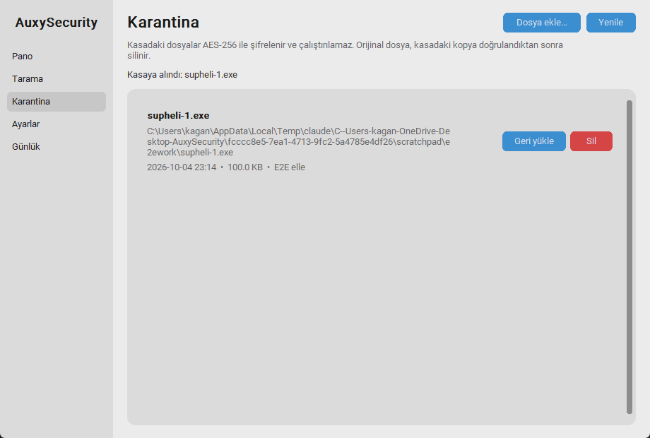
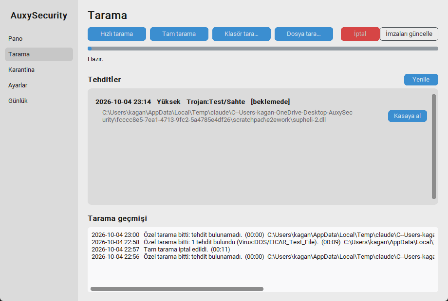

# M5 – Karantina Kasası (Vault)

**Durum:** İncelemede  **Tarih:** 2026-10-04

## 1. Hedef
Şüpheli dosyayı şifreleyip izole eden, geri yüklenebilir bir kasa; arayüz, CLI ve tehdit listesi entegrasyonuyla.

## 2. Kapsam / Kapsam dışı
- Kapsam: AES-256-GCM parçalı şifreleme, DPAPI anahtar koruması, SQLite meta verisi, koruma listesi, geri yükleme, kalıcı silme, GUI Karantina sayfası, tehdit listesinde "Kasaya al", CLI (`auxy vault`).
- Kapsam dışı (bölüm 8): Defender karantinasıyla eşitleme, anahtar yedeği dışa aktarma, klasör/çoklu seçim, yönetici gerektiren dosyalar için UAC.

## 3. Prototip: nasıl çalıştırılır
```powershell
.\.venv\Scripts\python -m auxy gui                       # sol menü > Karantina
.\.venv\Scripts\python -m auxy vault add C:\yol\dosya.exe --reason "supheli"
.\.venv\Scripts\python -m auxy vault list
.\.venv\Scripts\python -m auxy vault restore <id>        # --to <yol> / --overwrite
.\.venv\Scripts\python -m auxy vault delete <id> --yes   # kalıcı, geri alınamaz
```



**Not:** İkinci ekran görüntüsündeki "Trojan:Test/Sahte" kaydı **test için üretilmiş sahte bir tespit**dir (gerçek Defender kaydı değil), "Kasaya al" düğmesini göstermek için kullanıldı. Düğme, dosyası hâlâ diskte olan ve Defender'ın dokunmadığı (ya da geri yüklenmiş) tespitlerde çıkar.

## 4. Yapılanlar
- [x] `core/vault.py`: **.auxq biçimi**, 4 MB parçalar, her parça ayrı nonce; AAD = başlık + "son parça" bayrağı (kesme, ekleme, parça sırası değiştirme tespit edilir)
- [x] **Anahtar:** rastgele 256 bit, Windows **DPAPI** (kullanıcı kapsamı) ile korunup `vault.key`'de saklanır; düz anahtar diske yazılmaz
- [x] **Ekleme akışı:** şifrele → diske yaz + fsync → kasadaki kopyayı çöz ve özetini doğrula → kayıt ekle → **ancak sonra** orijinali sil. Orijinal silinemezse (kullanımda) kasa kopyası ve kayıt geri alınır
- [x] **Geri yükleme:** geçici dosyaya çöz → SHA-256 doğrula → atomik taşı; hedef varsa üzerine yazmaz (`--overwrite` / GUI'de başka yol seçtirir); orijinal değişiklik zamanı geri verilir
- [x] **Koruma listesi:** `C:\Windows`, Defender dizini, kasanın kendisi, AuxySecurity veri ve uygulama dosyaları, Python ortamı, klasörler, sembolik bağlantılar reddedilir
- [x] GUI **Karantina** sayfası: liste (ad, yol, tarih, boyut, neden), Geri yükle (risk uyarısı), Sil (kalıcı uyarısı), Dosya ekle…
- [x] **Tarama sayfası:** tehdit listesi artık satırlı; dosyası diskte olan yollarda **Kasaya al** düğmesi
- [x] CLI: `vault add|list|restore|delete`; kalıcı silme `--yes` olmadan çalışmaz
- [x] Her işlem günlüğe yazılır (denetim kaydı)
- [x] 89 test (30'u kasaya ait)

## 5. Teknik kararlar
- **Parçalı AEAD:** Büyük dosyalar belleğe yüklenmez; "son parça" bayrağı yüzünden dosyayı parça sınırından kesmek de doğrulamayı bozar.
- **Silmeden önce doğrula:** Kasadaki kopya çözülüp özeti karşılaştırılmadan orijinal silinmez; tüm hata yolları dosyayı yerinde bırakır (testle doğrulandı).
- **DPAPI:** Anahtar yönetimi kullanıcıya yük olmaz; ama anahtar Windows kullanıcısına bağlıdır (bölüm 8).
- **Kasa yetkisi:** Ayrı ACL eklenmedi: içerik şifreli ve `.auxq` uzantılı; `%LOCALAPPDATA%` zaten yalnızca kullanıcıya açık. "Çalıştırılamaz" kriteri şifreli içerikle sağlanıyor (aşağıda gerçek test).

## 6. Kabul kriterleri ve sonuçlar
| Kriter | Sonuç |
|---|---|
| Hash eşleşir, geri yüklenen dosya bire bir aynı | ✔ **Gerçek makinede:** 150 MB rastgele dosya, SHA-256 öncesi/sonrası **aynı**; ayrıca birim testlerinde parça sınırı durumları (0, 1, N-1, N, N+1, 3N bayt) |
| Kasadaki dosya çalıştırılamaz | ✔ **Gerçek makinede:** gerçek bir PE (`whoami.exe`) kasaya alındı, `.auxq` kopyası `.exe` yapılıp çalıştırılmak istendi: "geçerli bir uygulama değil". Geri yüklenen kopya yeniden çalıştı |
| Kasadaki içerik düz metin değil | ✔ test: işaretçi bayt dizisi blob'da yok; aynı veri iki kez farklı şifrelenir |
| Bozulma / kurcalama tespiti | ✔ tek bayt değişimi, parça sırası değişimi, kesme, ekleme, yanlış anahtar, bozuk başlık → net hata, geri yükleme iptal ve kayıt korunur |
| Silinemeyen (kullanımda) dosya | ✔ geri alma testi: dosya yerinde, kasa ve kayıt temiz |
| Koruma listesi | ✔ `System32\notepad.exe`, uygulamanın kendi dosyaları, kasa içi dosyalar, klasör, sembolik bağlantı reddedilir |
| GUI akışı | ✔ **Gerçek pencerede otomatik e2e:** kasaya al → listede görünür → tehdit listesinden "Kasaya al" → iki dosya → hepsi geri yüklendi, özetler eşit, kasa boş |
| Tarama sonuçlarından Kasaya al | ✔ (sahte tespit kaydıyla; bölüm 3 notu) |
| Testler | ✔ 89 passed |

## 7. Performans ölçümü
| Ölçüm | Sonuç |
|---|---|
| 150 MB kasaya alma (şifrele + doğrula + sil) | 0.7 sn |
| 150 MB geri yükleme | 0.5 sn |
| Bellek | Parçalı yapı: dosya boyutundan bağımsız, ~birkaç parça (≈8–16 MB) |
| Boşta yük | Yok: kasa yalnızca işlem sırasında çalışır |

## 8. Bilinen sorunlar / Riskler / Plandan sapmalar
- **Anahtar kaybı = veri kaybı.** DPAPI anahtarı Windows kullanıcısına bağlı; kullanıcı profili silinirse / Windows yeniden kurulursa kasa **açılamaz**. Yedek anahtarı dışa aktarma **yapılmadı** (M8'de, parolayla korunan dışa aktarma olarak planlı).
- **Microsoft Store Python sanallaştırması:** Kasa gerçekte Python paketinin özel `LocalCache` alanında duruyor (PowerShell/Explorer `AppData\Local\AuxySecurity\vault`'u görmüyor). **Python Store paketini kaldırmak/sıfırlamak kasayı da siler.** M9'da (PyInstaller sürümü) veri yolu normal bir konuma taşınacak ve geçiş (taşıma) sağlanacak; o zamana kadar kasaya **tek kopya olarak önemli dosya koyma**.
- **Defender karantinasıyla eşitleme yapılmadı:** Defender'ın kendi karantinasını listelemek/geri yüklemek yönetici gerektirir ve `MpCmdRun -Restore` çıktısı ayrıştırması kırılgan; ayrı iş olarak ele alınacak.
- **Orijinal dosya düz silinir** (güvenli silme değil): SSD/dosya sistemi kalıntısı kurtarılabilir. Zararlı için sorun değil; hassas veri için not.
- **Yönetici yetkisi gerektiren dosyalar** (ör. başka kullanıcının/`Program Files`) okunamaz/silinemez → net hata mesajı çıkar; UAC ile yükseltilmiş kasaya alma yok.
- **Klasör / çoklu seçim yok:** Yalnızca tek dosya. Çok dosyalı tespitte her yol için ayrı "Kasaya al".
- **Geri yüklenen zararlı:** Gerçek zamanlı koruma geri yüklenen dosyayı hemen yeniden karantinaya alabilir; arayüz geri yükleme öncesi risk uyarısı veriyor.
- **Şifreli içerik taranamaz:** Kasadaki dosya Defender tarafından incelenmez (şifreli); bu amaçlandığı gibi, ama kasayı "temiz" saymak yanlış.
- Kasa, **EICAR ile denenemedi:** Defender EICAR'ı yazıldığı anda sildiği için kasaya alınamadı; bunun yerine zararsız ama gerçekçi dosyalar (rastgele 150 MB, `whoami.exe`) kullanıldı.
- GUI'de onay pencereleri (`messagebox`) otomatik testte "evet" olarak taklit edildi; gerçek tıklama senin incelemende.
- Kasa listesi büyükse (yüzlerce kayıt) sayfalama yok.

## 9. İnceleme notları
_(Senin geri bildirimin buraya eklenecek.)_

## 10. Sonraki milestone'a etkisi
M6 (Tam Windows Security kapsamı) çekirdek servis ve `actions` katmanını yeni ayarlarla genişletecek: güvenlik duvarı, SmartScreen, Memory Integrity, exploit protection, dışlamalar, Cihaz güvenliği. Kasa M6'da değişmeden kalır; M8 anahtar yedeği ve veri yolu taşıma işini üstlenecek.
