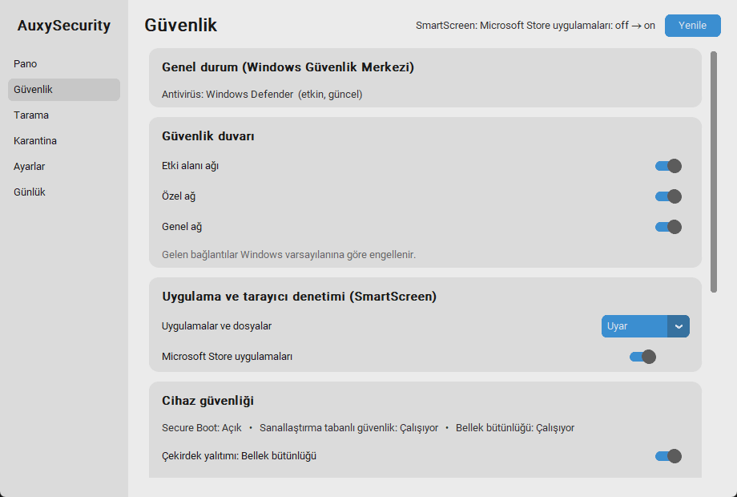

# M6 – Windows Security Kapsamı

**Durum:** İncelemede (yönetici yazma yolları gerçek makinede doğrulandı; **güvenlik duvarı yazma ve HVCI'yi gerçekten değiştirme hâlâ denenmedi**)  **Tarih:** 2026-10-04

> **Sonradan tamamlananlar:** **güvenlik duvarı kuralları** (listele/pasifleştir/program engelle), **gelen bağlantı eylemi**, tray güvenlik duvarı anahtarları eklendi; PowerShell'de Türkçe karakter hatası düzeltildi. Ayrıntı: [B01](B01-eksik-tamamlama.md).

## 1. Hedef
Defender dışındaki Windows Security bölümlerini (güvenlik duvarı, SmartScreen, çekirdek yalıtımı, cihaz güvenliği, Güvenlik Merkezi, exploit protection) ve Defender dışlamalarını tek yerden görmek ve yönetmek. Windows Security'ye yönlendirme yok.

## 2. Kapsam / Kapsam dışı
- Kapsam: bölüm 3'teki kapsam tablosu; geri alınabilir yazma; UAC akışı; GUI **Güvenlik** sayfası; CLI.
- Kapsam dışı (bölüm 8): güvenlik duvarı kuralları listesi/ekleme, Edge SmartScreen, exploit protection yazma, hesap koruması/aile seçenekleri.

## 3. Prototip: nasıl çalıştırılır
```powershell
.\.venv\Scripts\python -m auxy gui                      # sol menü > Güvenlik
.\.venv\Scripts\python -m auxy winsec-get               # tüm durum (salt-okunur)
.\.venv\Scripts\python -m auxy winsec-set fw_private off   # gerekirse UAC ister
.\.venv\Scripts\python -m auxy winsec-revert fw_private --elevate
.\.venv\Scripts\python -m auxy exclusion list path      # UAC ister
.\.venv\Scripts\python -m auxy exclusion add path C:\Projeler\derleme
.\.venv\Scripts\python -m auxy tpm-info                 # UAC ister
```


### Kapsam haritası (plan bölüm 3'e karşı durum)
| Windows Security bölümü | Ayar | Durum |
|---|---|---|
| Güvenlik duvarı | Etki alanı / Özel / Genel profil aç-kapat | ✔ yazılır (UAC), okuma kayıt defterinden |
| | Gelen bağlantı eylemi | ◐ yalnızca bilgi notu (değer bu makinede "yapılandırılmamış") |
| | Kural listesi | ✘ yapılmadı |
| SmartScreen | Uygulamalar ve dosyalar (Kapalı / Uyar / Engelle) | ✔ yazılır (UAC), `Explorer\SmartScreenEnabled` |
| | Microsoft Store uygulamaları | ✔ yazılır, **UAC gerekmez** (HKCU) |
| | Edge SmartScreen | ✘ (Edge'in kendi ayarı/ilkesi) |
| Exploit protection | DEP, SEHOP, CFG, zorunlu/aşağıdan yukarı/yüksek entropili ASLR | ◐ **salt-okunur** (neden: bölüm 5) |
| Cihaz güvenliği | Bellek bütünlüğü (HVCI) | ✔ yazılır (UAC + yeniden başlatma uyarısı), çalışma durumu ayrıca okunur |
| | Secure Boot, VBS | ✔ salt-okunur |
| | TPM | ✔ salt-okunur, **yönetici gerekir** (UAC'li "oku" düğmesi) |
| Genel durum | Antivirüs / güvenlik duvarı / casus yazılım ürünleri | ✔ salt-okunur (Güvenlik Merkezi, etkin/güncel) |
| Defender | Dışlamalar (yol, uzantı, işlem) | ✔ listele / ekle / kaldır (hepsi UAC) |
| Hesap koruması, Aile, Cihaz performansı | – | ✘ API yok; yönlendirme **bilerek eklenmedi** (isteğin) |

## 4. Yapılanlar
- [x] `core/winsec.py`: ayar tanımları, `WinSecService` (okuma, yazma, doğrulama, geri alma), Güvenlik Merkezi, cihaz güvenliği, exploit protection (salt-okunur), TPM
- [x] `core/exclusions.py`: dışlama listele/ekle/kaldır, sıkı doğrulama
- [x] `core/actions.py`: UAC akışı genelleştirildi (`run_elevated`: sonuç + veri), yeni eylemler `apply_winsec`, `exclusion_op`, `read_tpm`
- [x] GUI **Güvenlik** sayfası: kartlar, anahtarlar, SmartScreen menüsü, TPM düğmesi, dışlama listesi (Kaldır / Klasör·Uzantı·İşlem ekle), zayıflatıcı değişikliklerde onay penceresi
- [x] CLI: `winsec-get`, `winsec-set`, `winsec-revert`, `exclusion`, `tpm-info`
- [x] **Sonsuz UAC döngüsü koruması:** yükseltilmiş yardımcı yönetici alamazsa yeniden yükseltmeye çalışmaz
- [x] 144 test (55 yeni)
- [x] Test betikleri: `scripts/m6_live.py` (yönetici), `scripts/gui_security_e2e.py`

## 5. Teknik kararlar
- **Geri alınabilirlik zorunlu:** Her yazma, ilk değişiklikte orijinal değeri (değer yoksa "yok") yedekler; `winsec-revert` yoksa **değeri siler**. Defender yedeğiyle karışmaz (`ws:` öneki). Yazdıktan sonra geri okuma doğrulaması vardır.
- **Exploit protection salt-okunur:** Tüm sistem ayarları bu makinede `NOTSET` (= Windows varsayılanı). `Set-ProcessMitigation` tek bir ayarı "varsayılana döndürmeyi" sunmaz; açıp kapatmak ayarı kalıcı bir geçersiz kılmaya çevirir, **geri alınamaz** olur. Bu yüzden yazma eklenmedi.
- **Enjeksiyon önlemi:** Güvenlik duvarı profili ve ayar adları sabit listeden; dışlama değerleri PowerShell komut metnine **gömülmez**, ortam değişkeniyle aktarılır (`$env:AUXY_ARG`). Test: değer komut metninde yok.
- **Dışlama doğrulaması:** Tüm sürücü (`C:\`), Windows dizini, `Users`/kullanıcı profili kökü, joker karakter, UNC yolları, çalıştırılabilir/komut dosyası uzantıları (`exe, dll, ps1, bat, js, py…`) reddedilir. Geçersiz girdi UAC penceresine **hiç gitmez**.
- **Okuma yolları hızlı:** Güvenlik duvarı ve SmartScreen kayıt defterinden, Güvenlik Merkezi ve DeviceGuard WMI'dan; PowerShell yalnızca exploit protection ve TPM için.
- **Yönetici gerektirmeyen yazma:** Store SmartScreen (HKCU) doğrudan yazılır, UAC açılmaz.

## 6. Kabul kriterleri ve sonuçlar
| Kriter | Sonuç |
|---|---|
| Bölüm 3 tablosundaki her satır ✔ / salt-okunur / kısayol olarak işaretli | ✔ (yukarıdaki harita; ✘ olanların nedeni bölüm 8'de) |
| Tüm okuma yolları gerçek makinede çalışıyor | ✔ `winsec-get`: güvenlik duvarı, SmartScreen, HVCI çalışıyor, Secure Boot, VBS, Güvenlik Merkezi, exploit protection |
| HKCU yazma + geri alma gerçek makinede | ✔ Store SmartScreen: on→off→on; geri almada kayıt defteri değeri **silindi** (orijinal durum). CLI ve **GUI sayfası** üzerinden |
| SmartScreen uygulamalar (HKLM) yazma + geri alma | ✔ **Gerçek yönetici testi:** Uyar→Engelle (okunan: block) → geri alındı, kayıt değeri **silindi** (orijinal durum) |
| Dışlamalar (HKLM/Defender) | ✔ **Gerçek:** liste boştu; klasör eklendi (listede göründü), tekrar ekleme "zaten var" (değişiklik yok), kaldırıldı, liste başlangıçla aynı; `C:\` reddedildi |
| HVCI ayni degeri yazma | ✔ **Gerçek:** zaten açıktı, `changed=False` (gereksiz yeniden başlatma isteği yok) |
| TPM okuma (yönetici) | ✔ **Gerçek:** var/hazır/etkin/etkinleştirilmiş; NUL dolgulu sürüm metni **hata bulundu ve düzeltildi** (test eklendi) |
| Güvenlik duvarı profil yazma (UAC) | ⏳ **Doğrulanmadı:** `--firewall` adımı bilerek çalıştırılmadı (korumayı ~1,5 sn kapatır) |
| HVCI'yi gerçekten değiştirme (açık→kapalı) | ⏳ **Doğrulanmadı:** yeniden başlatma gerektirir ve geri dönüşü riskli; bilerek denenmedi |
| Test sonunda sistem başlangıçla aynı | ✔ `SONUC: BASLANGICLA AYNI` (kullanıcının yönetici çıktısı) |
| Geçersiz dışlama girdileri reddedilir | ✔ birim testleri (`C:\`, Windows, joker, UNC, `exe`/`dll`/`ps1` vb.) |
| Testler | ✔ 144 passed |

### Yönetici yazma testi (kullanıcı çalıştırdı, sonuç yukarıda)
Betik **güvenlik duvarına dokunmaz** (varsayılan). Yaptığı geçici değişiklikler: SmartScreen "Uyar→Engelle→geri" (daha sıkı, güvenli), Store SmartScreen aç/kapa/geri, geçici bir klasörü dışlamalara ekleyip kaldırma, HVCI'ye aynı değeri yazma (değişiklik yapmamalı), TPM okuma. Her şey `finally` ile geri alınır ve sonda "BASLANGICLA AYNI" kontrolü yapar.
```powershell
# Yönetici PowerShell'de, proje klasöründe:
.\.venv\Scripts\python scripts\m6_live.py $env:TEMP\m6.txt $env:TEMP\auxy-excl-test
Get-Content $env:TEMP\m6.txt
# Güvenlik duvarı Özel profili ~1,5 sn kapatıp açan adımı da istersen sonuna ekle: --firewall
```
Çıktıyı bana yapıştırırsan sonuçları buraya işlerim.

## 7. Performans ölçümü
| Ölçüm | Sonuç |
|---|---|
| Güvenlik sayfası açılışı | pencere ~730 ms, ~77 MB RSS |
| Durum okuma (kayıt defteri + WMI) | birkaç yüz ms (arka plan iş parçacığında) |
| Exploit protection okuma (PowerShell) | ~120 ms + süreç başlatma |
| Boşta yük | Yok: bu bölüm yalnızca sayfa açılınca/yenileyince çalışır |

## 8. Bilinen sorunlar / Plandan sapmalar
- **Güvenlik duvarı profil yazması denenmedi.** SmartScreen ve dışlamalar gerçek testte sessizce yok sayılmadı (Defender'ın `realtime`/`maps` davranışı bunlara yansımadı); `Set-NetFirewallProfile` için bilinmiyor. Servis yazdıktan sonra geri okuyup "değiştirilemedi" diyecek şekilde yazıldı.
- **Bellek bütünlüğü yazma yolu tehlike taşır:** Kayıt defterinden açmak Windows arayüzündeki uyumluluk denetimini atlar; uyumsuz sürücü varsa sorun çıkabilir. Onay penceresi uyarıyor; **bu yolu gerçek makinede yazarak denemedim** (yeniden başlatma gerektirir ve geri dönüşü riskli).
- **Windows Güvenlik Merkezi / SmartScreen kayıt değerleri sürüme bağlı:** Windows 11'in yeni sürümleri `SmartScreenEnabled` değerini farklı yorumlayabilir. Değer yazılıyor ve geri okunuyor ama Windows Security arayüzünde aynı etkiyi gösterdiği **doğrulanmadı**.
- **Güvenlik duvarı kuralları (listele/ekle/sil) yapılmadı.** Plan "salt-okunur → sonra ekle/sil" demişti; bu M8 sonrası backlog.
- **Edge SmartScreen ve kimlik avı koruması yok**: Edge'in kendi ayarı; yazılabilir kayıt defteri yolu güvenilir değil.
- **Gelen bağlantı eylemi** (`DefaultInboundAction`) bu makinede "yapılandırılmamış"; değiştirme sunulmadı.
- **Exploit protection yazma yok** (bölüm 5).
- **TPM bilgisi yalnızca yöneticiyle okunur;** her okuma UAC ister.
- **Dışlama listesi her "Listele"de UAC ister** (Defender yalnızca yöneticiye gösteriyor). Ajan yüksek yetkiyle çalışıyorsa (görev) UAC çıkmaz.
- Tray menüsüne bu bölümden hızlı anahtar eklenmedi (plan yalnızca M3 anahtarlarını kapsıyordu).
- Güvenlik sayfasında karanlık tema görsel olarak denenmedi.

## 9. İnceleme notları
_(Senin geri bildirimin buraya eklenecek.)_

## 10. Sonraki milestone'a etkisi
M7 (Gerçek zamanlı yardımcılar): İndirilenler klasörü izleme, Defender olay günlüğüne abonelik, bildirimler, zamanlanmış tarama. M6'daki `run_elevated` ve `ActionResult.data` yapısı kullanılabilir. Bölüm 8'deki doğrulanmamış yönetici yolları, sen testi çalıştırınca ya da M8'de kapatılacak.
