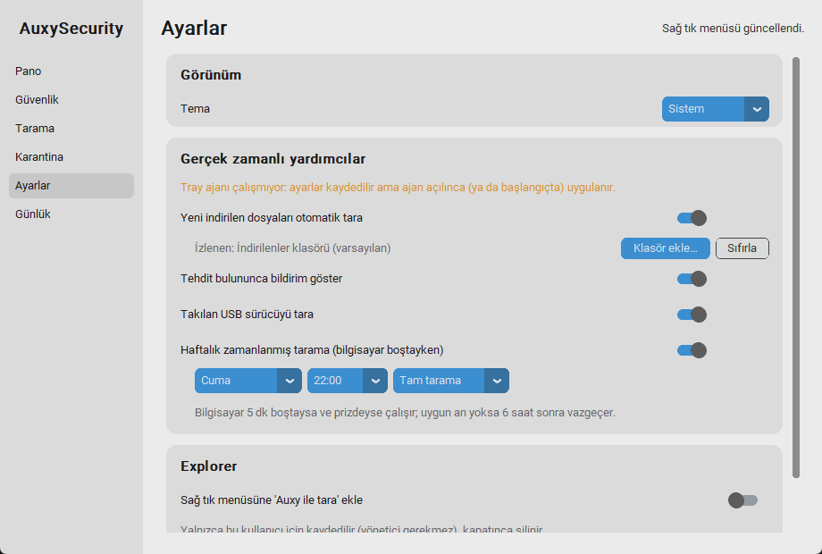

# M7 – Gerçek Zamanlı Yardımcılar

**Durum:** İncelemede  **Tarih:** 2026-10-04

> **Sonradan tamamlananlar:** **alt klasör izleme seçeneği** ve **sürükle-bırak taraması** eklendi. Ayrıntı: [B01](B01-eksik-tamamlama.md).

## 1. Hedef
Tray ajanına olay tabanlı yardımcılar eklemek: indirilen dosyaları otomatik taramak, Defender tehdit olaylarını bildirmek, USB sürücüleri taramak, haftalık tarama yapmak, sağ tık "Auxy ile tara". Hepsi boşta CPU kullanmamalı.

## 2. Kapsam / Kapsam dışı
- Kapsam: bölüm 3'teki beş yardımcı, ayar sayfası, ayarların ajana anında iletilmesi.
- Kapsam dışı: sürükle-bırak ile tarama (bölüm 8), alt klasörleri izleme, bildirimde düğme.

## 3. Prototip: nasıl çalıştırılır
1. Mevcut tray ajanını **kapat** (menüden *Çıkış*) ve yenisini aç: `.\.venv\Scripts\python -m auxy agent`
2. `python -m auxy gui` → **Ayarlar** → "Gerçek zamanlı yardımcılar". Anahtarlar kaydedilince ajan **anında** uygular (yeniden başlatma yok).
```powershell
.\.venv\Scripts\python -m auxy context-menu install    # sağ tık "Auxy ile tara" (yalnızca HKCU)
.\.venv\Scripts\python -m auxy context-menu remove
.\.venv\Scripts\python -m auxy scan-file C:\yol\dosya.exe   # sağ tık menüsünün çalıştırdığı komut (sonucu kutuyla gösterir)
```

(Ekran görüntüsü yalıtılmış test örneğinden; turuncu uyarı "ajan çalışmıyor" durumunun nasıl göründüğünü gösteriyor.)

| Yardımcı | Varsayılan | Nasıl çalışır |
|---|---|---|
| Yeni indirilen dosyaları tara | **kapalı** | `watchdog` (ReadDirectoryChangesW): olay gelene kadar uyur |
| Tehdit bildirimi | **açık** | `EvtSubscribe`: Defender olay günlüğüne itme (push) aboneliği, 1116/1117 |
| USB sürücüyü tara | **kapalı** | WMI `Win32_VolumeChangeEvent` bildirimi |
| Haftalık tarama | **kapalı** | tek zamanlayıcı; bilgisayar 5 dk boşta + prizde olmalı |
| Sağ tık "Auxy ile tara" | **kapalı** | HKCU kayıt defteri, tamamen geri alınabilir |
| Tray: "Tehdidi kasaya al: …" | – | son tehdit dosyası hâlâ diskteyse menüde görünür |

## 4. Yapılanlar
- [x] `core/config.py`: `config.json` (doğrulamalı, bozuk dosyaya dayanıklı); varsayılanlar temkinli
- [x] `agent/watchers.py`: `FolderWatcher`, `DefenderEventListener`, `UsbWatcher`, `ScheduledScanner`
- [x] `agent/helpers.py`: `HelperManager`: yalnızca **değişen** bileşeni yeniden başlatır; bir bileşen çökerse diğerleri etkilenmez
- [x] **Ayarın anında uygulanması:** GUI kaydedince adlı Windows olayı (`Local\AuxyConfigChanged`) ayarlanır, ajan uyanır; yoklama yok
- [x] **Toplu dosya koruması:** 10'dan fazla dosya aynı anda gelirse (zip açma) tek tek değil, klasör olarak (en çok 5) taranır; yarım indirme (`.crdownload` vb.) atlanır, yeniden adlandırma görülünce taranır; boyut sabitlenene kadar beklenir
- [x] `core/contextmenu.py` ve `scan-file` komutu; Ayarlar sayfası yeniden yazıldı (`gui/settings_page.py`)
- [x] `ScanManager.run(quiet=True)`: temiz otomatik taramalar geçmişi doldurmaz (tehdit/hata yazılır)
- [x] Tray: bildirim sarmalayıcı + "Tehdidi kasaya al" öğesi
- [x] 185 test (41 yeni): gerçek `watchdog` ile klasör izleme, gerçek Windows olayı ile uyandırma, gerçek (test alt anahtarında) kayıt defteri, zamanlama, USB, COM/iş parçacığı

## 5. Teknik kararlar
- **Hepsi olay tabanlı:** `watchdog`, `EvtSubscribe` ve WMI `NextEvent(5000)` bekleme sırasında CPU harcamaz. Tek sürekli iş yine ajanın 60 sn'lik durum yenilemesi.
- **Varsayılanlar kapalı:** Defender gerçek zamanlı koruması zaten dosyaları tarıyor; otomatik indirme taraması ek güvence ve açık bildirim için, isteyen açar.
- **İzin gerektirmez:** Hiçbir yardımcı yönetici istemez (olay günlüğü, `MpCmdRun` taraması, HKCU kayıt defteri hepsi kullanıcı yetkisiyle çalışır).
- **COM kuralı (gerçek hatadan):** WMI okuyan her fonksiyon `com_apartment()` içinde çalışır (bölüm 6).
- **Sağ tık için `pythonw`:** Menü komutu konsol penceresi açmaz; sonuç kutuyla gösterilir.

## 6. Gerçek hata: izleme iş parçacığı sessizce ölüyordu
Ajan uçtan uca testinde dosya taraması başlıyor ama bitmiyordu. Günlükte hata yoktu: izleme iş parçacığı yakalanmamış bir istisnayla ölmüştü (konsolsuz `pythonw`'da hata görünmez).
- **Kök neden:** `win32com.client.GetObject("winmgmts:…")`, COM'u başlatmamış bir iş parçacığında `MK_E_SYNTAX` ("Geçersiz sözdizimi") ile çöküyor. pywin32 COM'u yalnızca modülü ilk import eden iş parçacığı için başlatıyor. Ajanda ilk import durum yenileme iş parçacığında olduğu için izleme iş parçacığı etkilendi (aynı kod `python` ile çalışınca sorun çıkmamıştı).
- **Düzeltme:** `core/defender.com_apartment()`; `read_status`, `read_detections`, `read_security_center`, `read_device_security` kullanıyor. Ayrıca izleme döngüsü artık istisnayı **günlüğe yazıp devam ediyor** (iş parçacığı ölmüyor) ve tespit okunamazsa tarama sonucu yine geçerli sayılıyor.
- **Doğrulama:** Aynı gerçek ajan testi yeniden çalıştırıldı: günlükte hata yok, taramalar tamamlandı. Regresyon testleri eklendi.
- Bu sorun GUI'yi (her iş için yeni iş parçacığı açar) da etkileyebilirdi; `com_apartment` her yerde kullanıldığı için artık kapsanıyor.

## 7. Kabul kriterleri ve sonuçlar
| Kriter | Sonuç |
|---|---|
| Dosya düşünce tarama tetiklenir; CPU zirvesi sınırlı, boşta sıfıra döner | ✔ **Gerçek makine:** `program.exe` yazılınca tarandı; `.crdownload` yok sayıldı; `belge.pdf`'e yeniden adlandırma görülünce tarandı; 30 dosyalık yığın **tek klasör taramasına** dönüştü. Boşta CPU **0.00%** |
| Defender olay aboneliği tehdidi bildirir | ✔ **Gerçek makine:** özel tarama bir EICAR bulunca **1116 ve 1117** olayları ~10 sn'de ayrıştırılmış geldi (ad, şiddet "Ciddi", temiz yol, aksiyon "Karantina") |
| Ayar değişikliği ajana anında ulaşır | ✔ **Gerçek ajan:** izleme kapatma **0.11 sn**'de uygulandı; kapalıyken yeni dosya taranmadı; açınca tarandı |
| Sağ tık menüsü kurulur / çalışır / kaldırılır | ✔ **Gerçek HKCU:** iki anahtar yazıldı, Explorer'ın çalıştıracağı komut taramayı çalıştırdı, kaldırınca kalıntı yok |
| Ayarlar sayfası kaydeder / yükler | ✔ GUI e2e (yalıtılmış dizin): anahtarlar ve zamanlama menüleri config'e yazılıp geri okundu |
| Boşta yük (izleme + abonelik açık) | ✔ CPU **0.000%** (30 sn, ajan süreç ağacı); RAM: bölüm 8 |
| Haftalık tarama | ◐ Zamanlama mantığı (sonraki çalışma, boşta, prizde, 6 saat vazgeçme) birim testli; **gerçek bir haftalık tetiklenme beklenmedi** |
| USB taraması | ◐ Birim testli (çıkarılabilir değilse atla, tarar, bildirir, hata bildirir); **gerçek USB ile denenmedi** |
| Testler | ✔ 185 passed |

## 8. Performans ölçümü
| Ölçüm | Sonuç |
|---|---|
| Ajan CPU, izleme + olay aboneliği açık (30 sn) | 0.000% |
| Ajan RAM (çalışma kümesi) | **42.7 MB** (hedef 40 MB: hâlâ hafifçe üstünde) + venv başlatıcı 11.8 MB (kurulu sürümde yok) |
| Ayar sinyali → uygulama | 0.11 sn |
| Dosya düşmeden tarama başlamasına kadar | ~3–4 sn (2 sn toplama penceresi + boyut sabitlenme kontrolü) |

## 9. Bilinen sorunlar / Plandan sapmalar
- **Çalışan tray ajanın eski kodla çalışıyor.** M7 yardımcıları için ajanı kapatıp yeniden açman gerekir (bölüm 3).
- **Sürükle-bırak taraması yapılmadı:** ek bağımlılık (`tkinterdnd2`) ister; sağ tık menüsü ve "Klasör/Dosya tara…" aynı işi görüyor. Backlog.
- **Bildirimler görsel olarak denenmedi:** Windows balonunu ekranda göremiyorum; olay → bildirim metni birim testli, gerçek balon senin incelemende. Balonda "Kasaya al" düğmesi yok (pystray desteklemiyor); onun yerine tray menüsünde "Tehdidi kasaya al: …" öğesi çıkıyor.
- **Alt klasörler izlenmiyor** (yalnızca seçilen klasörün kendisi). İndirilenler için yeterli; `recursive=False` bilerek (gürültü ve yük).
- **USB:** yalnızca `DRIVE_REMOVABLE` sürücüler; harici USB sabit diskler Windows'ta "sabit" görünür, taranmaz. Gerçek USB ile test edilmedi.
- **Haftalık tarama gerçekten çalıştırılmadı** (bir hafta beklemek gerekirdi). Zamanlama hesapları ve kararlar birim testli.
- **Aynı anda tek tarama:** İki bileşen (ör. USB ve indirme) aynı anda tarama isterse biri `ScanBusy` ile 30 sn bekleyip yeniden dener (en çok 5 deneme), sonra vazgeçer. GUI/tray ile ajan arasında süreçler arası kilit yok (M4 notu geçerli).
- **Gözlem (hata değil):** Defender'ın gerçek zamanlı koruması, Python ile yazılan EICAR dosyasını iki denemede yazma anında yakalamadı (PowerShell ile yazılan ilkini yakalamıştı); özel tarama hepsini buldu. Bu yüzden otomatik indirme taraması anlamlı bir ek güvence; yine de Defender davranışı konusunda kesin yargıya varılamaz.
- **Tehdit bildirimi dosya adını içerir** (Windows bildirim merkezinde bir süre görünür).
- Ajan RAM'i hedefin üstünde (42.7 MB); M8'de azaltılacak (`watchdog` ve olay günlüğü eklenince ~2 MB arttı).

## 10. İnceleme notları
_(Senin geri bildirimin buraya eklenecek.)_

## 11. Sonraki milestone'a etkisi
M8 (Sağlamlaştırma): ajan RAM'ini 40 MB altına indirme, tek örnek/çökme kurtarma, kasa anahtarı yedeği (parola korumalı dışa aktarma), veri yolu taşıma altyapısı, güvenlik gözden geçirmesi (UAC ile çalışan kodun yazılabilir dizinlerden gelmesi), test kapsamı ölçümü ve sanal makinede kurulum/kaldırma testi. Bu milestone'daki COM dersi, "sessiz iş parçacığı ölümü" için genel bir tarama sağlamlaştırma maddesine dönüşecek.
